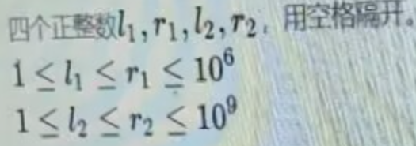
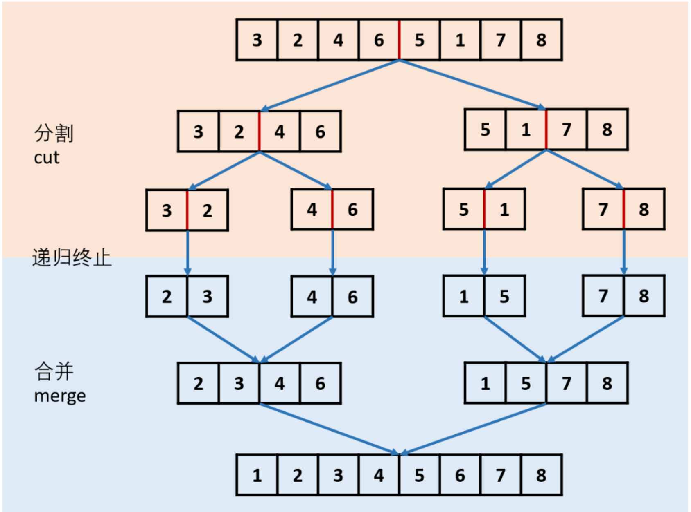
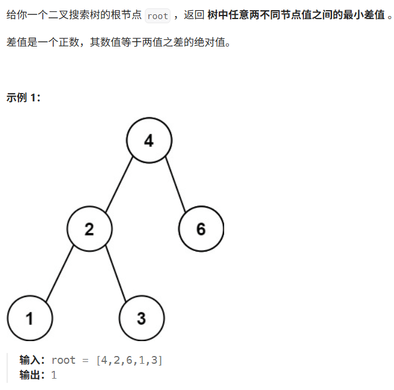
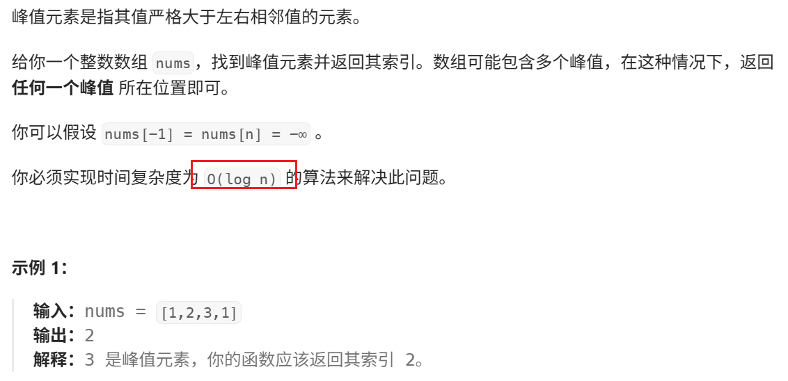
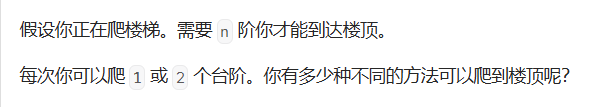
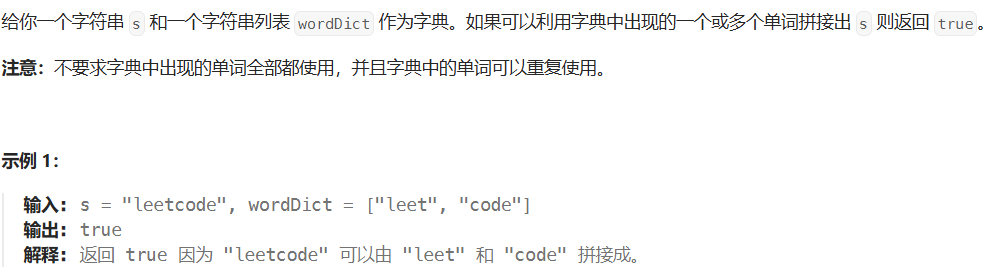
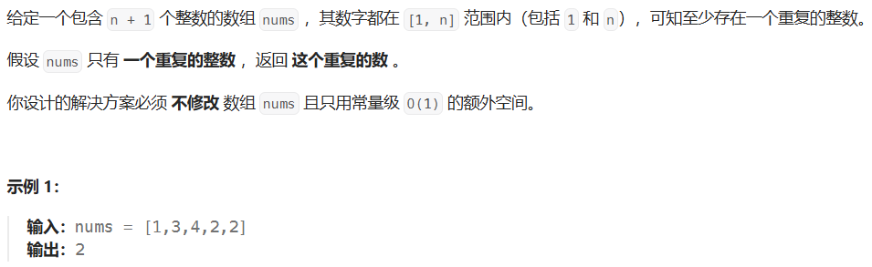
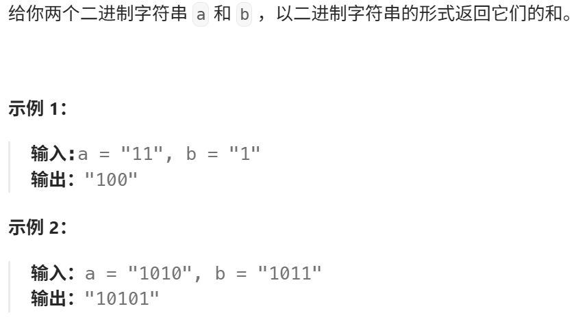

# 集合类常考点

- 集合类里面要用包装类：Integer->int，Character->char
- List集合，add，remove(下标)，常用remove(list.size()-1)来移除最后一位
- Collections有很多好用的对list的方法：

```java
Collections.max(list);
Collections.min(list);
Collections.sort(list);//升序
list.sort((o1, o2)->o1-o2);//也是升序
Collections.binarySearch(list, 100);//二分查找下标   
```

- Queue对应的是new LinkedList<>(); 函数：add/offer，peek/element，remove/poll
- Deque对应的是new LinkedList<>(); 函数：addFirst，addLast，peekFirst，peekLast，removeFirts，removeLast，getFirts，getLast
  PS：Deque<Integer> outStack=new ArrayDeque<>();是用数组实现的deque，一般在模拟题会用(栈模拟队列)
- 要考虑Queue是否为空
- Map对应的是new HashMap<>(); 函数：：put，get，remove(key)，containsKey，containsValue, **map.keySet()**
- Map还有个好用的：map.getOrDefault(c, 0) 如果没有C的话就自动添加；map.values()返回所有value，可见(字母异位词分组)
- Set集合：add(值)，remove(值)
- 字符数组与字符串互转：char[] strArray = str.toCharArray();    
  **String key = Arrays.toString(strArray);或者String key = new String(strArray);**
- 字符串分割函数：String new = old.substring(start, end);
- String[] str = a1.split(" ");
- StringBuilder对象，append，delete(start, end)，deleteCharAt()，toString()
- dfs模板
  

	


# 原地维护有序数组(双指针)


**解析**：这个题要我们在**原数组里直接修改**，那么我们就只能用双指针。

用aim来表示最终结果数组的下标(可以看作一个新的nums，只不过是在原nums上进行操作)，value来表示最新的值，temp表示计数器

主要逻辑就是当计数器为2或者出现新的数时，就把i这个数拿到aim对应的位置上，并且aim++

(**反思**：这道题让我明白了，aim和value分开来的思想，value不是num[aim]，aim仅代表结果序列的下标，value代表最新值。作比较的是value，给结果赋值的是aim)

```java
class Solution {
    public int removeDuplicates(int[] nums) {
        int aim=1, value=nums[0], temp=1;//temp为计数器,aim其实可以看做最终结果序列的下标
        for(int i=1; i<nums.length; i++){
            if(nums[i]!=value){
                temp=1;
                value = nums[i];
                nums[aim]=nums[i];
                aim++;
            }
            else {
                temp++;
                if(temp==2){
                    nums[aim]=nums[i];
                    aim++;
                }
            }
        }
        return aim;
    }
}
```


# 轮转数组(翻转法)


我们发现每次往后移k mod n位，最后k mod n个数字都会到前面来，其余元素移动k mod n位。

我们其实可以看作是把数组进行了翻转，把后面的数字翻转到前面来，然后再针对局部进行翻转

```java
class Solution {
    public void rotate(int[] nums, int k) {
        k%=nums.length;
        reverse(nums, 0, nums.length-1);
        reverse(nums, 0, k-1);
        reverse(nums, k, nums.length-1);
    }

    public void reverse(int[] nums, int start, int end){
        while(start<end){
            int temp = nums[start];
            nums[start]=nums[end];
            nums[end]=temp;
            start+=1;
            end-=1;
        }
    }
}
```


# 时间插入删除随机(变长数组+哈希)


实际上更像是个模拟题

要实现O(1)的时间复杂度 -> 哈希，并且最后取随机 -> 变长数组

哈希里面，**val为key，对应的数组里的下标(长度)为value；**

```java
class RandomizedSet {
    List<Integer> nums;
    Map<Integer, Integer> res;
    Random random;

    public RandomizedSet() {
        nums = new ArrayList<Integer>();
        res = new HashMap<Integer, Integer>();
        random = new Random();
    }
    
    public boolean insert(int val) {
        if(res.containsKey(val)) {
            return false;
        }
        int i = nums.size();
        nums.add(val);
        res.put(val, i);
        return true;
    }
    
    public boolean remove(int val) {
        if(!res.containsKey(val)){
            return false;
        }
        //当前位和最后一位交换
        int i = res.get(val);//由insert可知是i实际上是下标（也是当时对应的长度）
        int last = nums.get(nums.size()-1);
        nums.set(i, last);
        res.put(last, i);
        nums.remove(nums.size()-1);
        res.remove(val);
        return true;
    }
    
    public int getRandom() {
        int randomIndex = random.nextInt(nums.size());
        return nums.get(randomIndex);
    }
}
```


# 加油站(贪心+数学推导)


数学推导：

1.我们发现从x出发，最后可以到达y，那么可以得出：


2.现在我们探讨，从[x, y]中任意一个z出发能否到达y+1的加油站：


从这个式子中我们可以得出，z无论如何都无法到达y+1的加油站。

因此我们可以从0开始往后遍历，用cnt记录步数，能绕一圈则成功，不能则从第一个无法到达的点+1开始重新往后遍历，cnt也重置为0。

```java
class Solution {

    public int canCompleteCircuit(int[] gas, int[] cost) {
        //数学推导出一个性质：从x出发，最远能到y，那么从(x,y)中任意一个数z开始都无法到达y+1
        //所以我们从0开始走，走到第一个无法走的地方a就停下，从a+1开始
        int n = gas.length;
        int i=0;
        while(i<n){
            int sumOfGas=0, sumOfCost=0;//从当前位置开始加的gas和花费的cost的和
            int cnt=0;//步数
            while(cnt<n){
                int j=(i+cnt)%n;//%是用来>n-1时回到0
                sumOfGas+=gas[j];
                sumOfCost+=cost[j];
                if(sumOfGas<sumOfCost) break;//走不动了
                cnt++;
            }
            if(cnt==n) return i;
            else i+=cnt+1;
        }
        return -1;
    }
}
```


# 分发糖果

​	

我们从前往后遍历，如果rating[i]>rating[i-1]，则给i同学分配pre+1个糖果。

但是这里我们会发现，改变了后面的糖果数后，因为相邻两个孩子评分更高更多，所以还得反过去改前面，所以我们**需要维护一个递减数组dec和递增数组inc，因为结果只要数量，所以只需要dec和inc表示数量即可。**

如果rating[i]<rating[i-1]说明是递减要给dec数组里所有糖果数+1，因为dec表示递减数组数量，所以结果直接加dec即可。(PS：如果递减序列长度dec和递增序列长度inc一致，则需要把递增序列最后一个同学并入dec)

**我们其实也会发现，无论后面怎么变，也只会影响最近的递增数组的最大的一个**

```java
class Solution {
    public int candy(int[] ratings) {
        int n = ratings.length;
        int ret=1;
        int inc = 1, dec = 0, pre=1;
        for(int i=1; i<n; i++){
            if(ratings[i]>=ratings[i-1]){//递增序列
                dec=0;
                pre = (ratings[i] == ratings[i-1] ? 1 :pre+1);//给当前同学分配pre+1
                ret+=pre;//并入结果
                inc = pre;//因为是+1递增，当前同学已经pre+1了，inc的长度也就是pre大小
            }else {
                dec++;
                if(dec==inc){//递增序列最后一个同学并入递减
                    dec++;
                }
                ret+=dec;
                pre=1;
            }
            System.out.println(dec+" "+inc+" "+pre);
        }
        return ret;
    }
}
```

官方图解：


# 两数之和(无序+map)1


**从左到右遍历，用map来get，有就返回，无则put**

```java
class Solution {
    public int[] twoSum(int[] nums, int target) {
        Map<Integer, Integer> map = new HashMap<Integer, Integer>();
        for(int i=0; i<nums.length; i++) {
            int num = nums[i];
            if(map.get(target-num)!=null) return new int[]{i, map.get(target-num)};
            else map.put(nums[i], i);
        }
        return new int[]{0, 0};
    }
}
```


# *两数之和(有序+O(n)重要双指针用法

**后续的双指针都可以按照这个思想延申**


直接backend=0, front=n-1然后大于目标front--，小于则backend++

会不会出现backend>=front的情况呢？因为数组的有序性，是不会出现这种情况的

```java
class Solution {
    public int[] twoSum(int[] numbers, int target) {
        int front=numbers.length-1, backend=0;
        while(numbers[backend]+numbers[front]!=target){
            if(numbers[backend]+numbers[front]>target) {
                front--;
                continue;
            }
            if(numbers[backend]+numbers[front]<target) {
                backend++;
                continue;
            }
        }
        int[] res = new int[2];
        res[0]=backend+1;
        res[1]=front+1;
        return res;
    }
}
```


# Z字形变化(字符串索引)

	

要求：将输入的字符串s，按照给定的numRows行数进行Z字行输出(其实更像N字形)。

PS：这里有个细节，结尾只要求我们输出字符串，而不是图形。也就是说只要保证每行里的字符没问题就行，不用考虑每行里字符应该是多少间距。

思路：遍历的同时模拟N字形，可以用二维数组下标，也可以用List<StringBuilder>。规律：每次遍历到0或者numRows-1的时候(也就是行的头尾)就要往反方向遍历了。

```java
class Solution {
    public String convert(String s, int numRows) {
        if(numRows<2) return s;
        List<StringBuilder> rows = new ArrayList<StringBuilder>();
        for(int i=0; i<numRows; i++) rows.add(new StringBuilder());
        
        int i=0, flag=-1;
        for(char c : s.toCharArray()){
            rows.get(i).append(c);
            if(i==0 || i==numRows-1) flag = -flag;//换方向
            i+=flag;
        }

        StringBuilder res = new StringBuilder();
        for(StringBuilder row:rows) res.append(row);
        return res.toString();
    }
}
```


# 找第一个字符串匹配的项(KMP)


题能暴力解，时间复杂度O(n*m)。主要学习KMP，时间复杂度O(n+m)。

主要分为两部分：构造next数组，匹配两个串

详细原理请见：https://leetcode.cn/problems/find-the-index-of-the-first-occurrence-in-a-string/solutions/1/shua-chuan-lc-shuang-bai-po-su-jie-fa-km-tb86

这个板子有个前提，给ss和pp串前面加了个" "**让他们下标从1开始**。

**第一部分：构造next数组** 

i从2开始，j从0开始

```java
// 构建 next 数组，数组长度为匹配串的长度（next 数组是和匹配串相关的）
        int[] next = new int[m + 1];
        // 构造过程 i = 2，j = 0 开始，i 小于等于匹配串长度 【构造 i 从 2 开始】
        for (int i = 2, j = 0; i <= m; i++) {
            // 匹配不成功的话，j = next(j)
            while (j > 0 && p[i] != p[j + 1]) j = next[j];
            // 匹配成功的话，先让 j++
            if (p[i] == p[j + 1]) j++;
            // 更新 next[i]，结束本次循环，i++
            next[i] = j;
        }
```

	(中间是下标)

**第二部分：匹配**

i从1开始，j从0开始

```java
    // 匹配过程，i = 1，j = 0 开始，i 小于等于原串长度 【匹配 i 从 1 开始】
    for (int i = 1, j = 0; i <= n; i++) {
        // 匹配不成功 j = next(j)
        while (j > 0 && s[i] != p[j + 1]) j = next[j];
        // 匹配成功的话，先让 j++，结束本次循环后 i++
        if (s[i] == p[j + 1]) j++;
        // 整一段匹配成功，直接返回下标
        if (j == m) return i - m;
    }
```

	

完整代码：

这个板子很好记，因为是对称关系。只需要记next是i从2，j从0;匹配是i从1 j从0；然后for里面只有三步就OK

```java
class Solution {
    // KMP 算法
    // ss: 原串(string)  pp: 匹配串(pattern)
    public int strStr(String ss, String pp) {
        if (pp.isEmpty()) return 0;
        
        // 分别读取原串和匹配串的长度
        int n = ss.length(), m = pp.length();
        // 原串和匹配串前面都加空格，使其下标从 1 开始
        ss = " " + ss;
        pp = " " + pp;

        char[] s = ss.toCharArray();
        char[] p = pp.toCharArray();

        // 构建 next 数组，数组长度为匹配串的长度（next 数组是和匹配串相关的）
        int[] next = new int[m + 1];
        // 构造过程 i = 2，j = 0 开始，i 小于等于匹配串长度 【构造 i 从 2 开始】
        for (int i = 2, j = 0; i <= m; i++) {
            // 匹配不成功的话，j = next(j)
            while (j > 0 && p[i] != p[j + 1]) j = next[j];
            // 匹配成功的话，先让 j++
            if (p[i] == p[j + 1]) j++;
            // 更新 next[i]，结束本次循环，i++
            next[i] = j;
        }

        // 匹配过程，i = 1，j = 0 开始，i 小于等于原串长度 【匹配 i 从 1 开始】
        for (int i = 1, j = 0; i <= n; i++) {
            // 匹配不成功 j = next(j)
            while (j > 0 && s[i] != p[j + 1]) j = next[j];
            // 匹配成功的话，先让 j++，结束本次循环后 i++
            if (s[i] == p[j + 1]) j++;
            // 整一段匹配成功，直接返回下标
            if (j == m) return i - m;
        }

        return -1;
    }
}
```


# 三数之和


做法一(自己想的)：遍历第一个数，然后第二和第三个数用两数之和，引入set去重

```java
class Solution {
    Set<List<Integer>> res = new HashSet<>();
    List<List<Integer>> ans = new ArrayList<>();

    public List<List<Integer>> threeSum(int[] nums) {
        Arrays.sort(nums);
        int n = nums.length;
        for(int i=0; i<n-2; i++){
            check(i, nums);
        }

        for(List<Integer> i : res){
            ans.add(i);
        }
        return ans;
    }

    public void check(int front, int[] nums){
        int n = nums.length;
        int i=front+1, j=n-1;
        if(i>=j) return;
        while(i<j){
            if(nums[front]+nums[i]+nums[j]==0) {
                List<Integer> temp = new ArrayList<>(Arrays.asList(nums[front],nums[i],nums[j]));
                res.add(temp);
                i++;
                j--;
                continue;
            }
            if(nums[front]+nums[i]+nums[j]>0) {
                j--;
                continue;
            }
            if(nums[front]+nums[i]+nums[j]<0) {
                i++;
                continue;
            }
        }
    }
}
```

方法二(标答)：另一种双指针

```java
class Solution {
    List<List<Integer>> res = new ArrayList<>();

    public List<List<Integer>> threeSum(int[] nums) {
        Arrays.sort(nums);
        int n = nums.length;
        for(int i=0; i<n; i++){
            if(i>0 && nums[i]==nums[i-1]) continue;
            check(i, nums);
        }
        return res;
    }

    public void check(int front, int[] nums){
        int n = nums.length;
        for(int i=front+1, j=n-1; i<n; i++){
            if(i>front+1 && nums[i]==nums[i-1]) continue;
            while(i<j && nums[front]+nums[i]+nums[j]>0) j--;
            if(i>=j) return;
            if(nums[front]+nums[i]+nums[j]==0) {
                List<Integer> ans = new ArrayList<>(Arrays.asList(nums[front],nums[i],nums[j]));
                res.add(ans);
            }
        }
    }
}
```


# 有效的数独(哈希)

	

很简单的哈希的题:

行和列只需要维护两个哈希就行row[9] [index max = 9] line[9] [index max = 9]

小九宫格可以用一个三维数组box[3] [3] [index max = 9] //表示横3个竖3个九宫格每个九宫格里可以放9个数

易错点：读题读仔细，直接输入的是9x9大矩形，而不是一行表示一个小九宫格。

需要考虑的点：九宫格的下标如何确定，这里选择i/3和j/3

```java
class Solution {
    public boolean isValidSudoku(char[][] board) {
        int[][] rows = new int[9][9];
        int[][] line = new int[9][9];
        int[][][] box = new int[3][3][9];

        for(int i=0; i<9; i++){
            for(int j=0; j<9; j++){
                char c = board[i][j];
                if(c!='.'){
                    int index = c-'0'-1;
                    rows[i][index]++;
                    line[j][index]++;
                    box[i/3][j/3][index]++;
                    if(rows[i][index]>1 || line[j][index]>1 || box[i/3][j/3][index]>1) return false;
                }
            }
        }
        return true;
    }
}
```


# 矩阵置零(原地+两个变量)


因为数据小可以用暴力，但是没意思，所以这里使用了原地+两个常量空间来解决。

**思路**：只要(x,y)==0,  **标记(0, y)=0,  (x,0)=0**。但是第0行和第0列就无法标记了，所以引入**两个变量来记录第0行和第0列**是否有0。

***注意**：最开始我想的是遍历第0行和第0列然后对分别置零行和列，但是会出现问题。所以最好的方法是**从(1,1)遍历非第0行和第0列的数组，然后判断(0, y)=0||(x,0)=0，成立则只对当前位置赋值0**。

```java
class Solution {
    public void setZeroes(int[][] matrix) {
        int row = matrix.length;
        int col = matrix[0].length;
        boolean row1 = false;
        boolean col1 = false;

        for(int i=0; i<row; i++){//0列
            if(matrix[i][0]==0) col1 = true;
        }
        for(int j=0; j<col; j++){//0行
            if(matrix[0][j]==0) row1 = true;
        }

        for(int i=1; i<row; i++){
            for(int j=1; j<col; j++){
                if(matrix[i][j]==0) matrix[i][0]=matrix[0][j]=0;
            }
        }

        for(int i=1; i<row; i++){
            for(int j=1; j<col; j++){
                if(matrix[i][0]==0 || matrix[0][j]==0){
                    matrix[i][j]=0;
                }
            }
        }

        if(row1==true) for(int i=0; i<col; i++) matrix[0][i]=0;
        if(col1==true) for(int j=0; j<row; j++) matrix[j][0]=0;
    }
}
```


更加进阶的做法：原地+1个常量空间

我们可以对方法二进一步优化，只使用一个标记变量记录第一列是否原本存在 0。这样，**第一列的第一个元素即可以标记第一行是否出现 0**。但为了防止每一列的第一个元素被提前更新，我们需要**从最后一行开始，倒序地处理矩阵元素**。

```java
class Solution {
    public void setZeroes(int[][] matrix) {
        int m = matrix.length, n = matrix[0].length;
        boolean flagCol0 = false;
        for (int i = 0; i < m; i++) {
            if (matrix[i][0] == 0) {
                flagCol0 = true;
            }
            for (int j = 1; j < n; j++) {
                if (matrix[i][j] == 0) {
                    matrix[i][0] = matrix[0][j] = 0;
                }
            }
        }
        for (int i = m - 1; i >= 0; i--) {
            for (int j = 1; j < n; j++) {
                if (matrix[i][0] == 0 || matrix[0][j] == 0) {
                    matrix[i][j] = 0;
                }
            }
            if (flagCol0) {
                matrix[i][0] = 0;
            }
        }
    }
}
```


# 生命游戏（通过状态来原地修改矩阵）


	

非原地做法：多用一个表

```java
class Solution {
    int n=0;
    int m=0;
    int[] pox = {-1,  0, 1, -1, 1, -1, 0, 1};
    int[] poy = {-1, -1, -1, 0, 0, 1, 1, 1};


    public void gameOfLife(int[][] board) {
        n = board.length;
        m = board[0].length;
        int[][] temp = new int[n][m];

        for(int i=0; i<n; i++){
            for(int j=0; j<m; j++){
                temp[i][j]=check(i, j, board);
            }
        }

        for(int i=0; i<n; i++){
            for(int j=0; j<m; j++){
                board[i][j]=temp[i][j];
            }
        }
    }

    int check(int x, int y, int[][] board){
        int num1=0;//huo
        for(int i=0; i<8; i++){
                int X = x+pox[i];
                int Y = y+poy[i];
                if(X>=0 && X<n && Y>=0 && Y<m){
                    if(board[X][Y]==0) num0++;
                    else num1++;
                }
        }

        if(board[x][y]==0){
            if(num1==3) return 1;
            return 0;
        }else{
            if(num1>3 || num1<2) return 0;
            return 1;
        }
    }
}
```

原地修改:

利用特殊状态：-1表示过去活现在死，2表示现在死过去活，并且修改判断语句以及相应四个规则即可

```java
class Solution {
    //-1表示过去活现在死，2表示现在死过去活
    int n=0;
    int m=0;
    int[] pox = {-1,  0, 1, -1, 1, -1, 0, 1};
    int[] poy = {-1, -1, -1, 0, 0, 1, 1, 1};


    public void gameOfLife(int[][] board) {
        n = board.length;
        m = board[0].length;

        for(int i=0; i<n; i++){
            for(int j=0; j<m; j++){
                check(i, j, board);
            }
        }

        for(int i=0; i<n; i++){
            for(int j=0; j<m; j++){
                if(board[i][j]>0) board[i][j]=1;
                else board[i][j]=0;
            }
        }
    }

    void check(int x, int y, int[][] board){
        int num1=0;//huo
        for(int i=0; i<8; i++){
            int X = x+pox[i];
            int Y = y+poy[i];
            if(X>=0 && X<n && Y>=0 && Y<m){
                if(board[X][Y]==1 || board[X][Y]==-1) num1++;
            }
        }

        if(board[x][y]==0 && num1==3) board[x][y] = 2;
        if((board[x][y]==1) && (num1>3 || num1<2)) board[x][y] = -1;
    }
}
```


# 同构字符串（哈希存法）

	

因为是一一对应关系，**我们只需要把key,value分别存对方就行**。一旦发现A的key对应的value不是当前B的值，则false

```java
class Solution {
    public boolean isIsomorphic(String s, String t) {
        int n = s.length();
        char[] sa = s.toCharArray();
        char[] ta = t.toCharArray();

        Map<Character, Character> mapS = new HashMap<>();
        Map<Character, Character> mapT = new HashMap<>();

        for(int i=0; i<n; i++){
            char x = sa[i];
            char y = ta[i];
            if((mapS.containsKey(x)&&mapS.get(x)!=y)||(mapT.containsKey(y)&&mapT.get(y)!=x)) 
                return false;
            mapS.put(x, y);
            mapT.put(y, x);
        }
        return true;

    }
}
```


# 字母异位词分组(String和Map函数易错)1


复习改正：

```java
class Solution {
    public List<List<String>> groupAnagrams(String[] strs) {
        List<List<String>> res = new ArrayList<>();
        Map<String, List<String>> map = new HashMap<>();
        for(String cur : strs){
            char[] oldIndex = cur.toCharArray();
            Arrays.sort(oldIndex);
            //错误点1：不要用toString要用new String(char[])
            String newIndex = new String(oldIndex);
            //错误点2：不能直接map.get.add要用List<>承接，然后add到list，最终put到map
            List<String> temp = map.getOrDefault(newIndex, new ArrayList<>());
            temp.add(cur);
            map.put(newIndex, temp);
        }
        for(String cur : map.keySet()){
            res.add(map.get(cur));
        }
        return res;
    }
}
```


# 快乐数字(数学+Map)

		

我们随便试几个数，会得出三种可能：1，循环，无限大

第一二种比较好验证，主要是第三种，我们可以试着把每一位为9时，即最大值对应的next求出来：

	

从这里可以看出，三位数999的next为243，也就是说三位数，要么为1，要么在243内的某个数循环，包括后面4位数，最大为324，在999范围内，13位数，最大为4位数，四位数就会退化为3位数......这么下来就可以知道不会存在无限大

这样的就简单了，我们直接暴力拆解每个数，用map记录，如果重复就return false

```java
class Solution {
    public boolean isHappy(int n) {
        Map<Integer, Integer> map = new HashMap<>();
        while(n!=1 && !map.containsKey(n)){
            map.put(n, 1);
            n = calcutale(n);
        }
        return n==1;
    }

    public int calcutale(int n){
        int res=0;
        while(n!=0){
            res+=(n%10)*(n%10);
            n/=10;
        }
        return res;
    }
}
```


# 合并区间(左边界升序+并集)

	

**思考点：当前R<目标L，说明无法合并，其余的可合并**

主要是处理边界，根据左边界**升序**，那么在**结果队列里最后一个元素也是L，R最大**的，可以直接拿去和剩余值比较。

- 如果结果队列R<当前区间L，说明无法合并，可以直接放入
- 否则说明可以合并，并且直接取双方R的最大值就行。

(PS：我们根据L来升序的，所以可以不考虑L直接取R最大值)

```java
class Solution {
    public int[][] merge(int[][] intervals) {
        if(intervals.length == 0) return new int[0][2];
        Arrays.sort(intervals, new Comparator<int[]>(){
            public int compare(int[] interval1, int[] interval2){
                return interval1[0] - interval2[0];
            }
        });
        
        List<int[]> merged = new ArrayList<int[]>();
        for(int i=0; i<intervals.length; i++){
            int L = intervals[i][0], R = intervals[i][1];
            if(merged.size()==0 || merged.get(merged.size()-1)[1]<L){
                merged.add(new int[]{L, R});
            }else{
                merged.get(merged.size()-1)[1] = 
                Math.max(merged.get(merged.size()-1)[1], R);
            }
        }
        return merged.toArray(new int[merged.size()][]);
    }
}
```


# 插入区间(增强for+集合)

这个题给我的启发是，如果遇到**新的结果集合需要单独列指针的**，或许可以用**增强for来遍历筛选装入集合**，最后再装入结果集

	

要点是打草稿，区分好几种情况：

**思考点：三种，左侧无交集，需要合并，右侧无交集**

```java
class Solution {
    public int[][] insert(int[][] intervals, int[] newInterval) {
        int left = newInterval[0];
        int right = newInterval[1];
        boolean placed = false;
        List<int[]> ansList = new ArrayList<int[]>();
        for(int[] interval : intervals){
            if(interval[0]>right){
                //右侧且无交集
                if(!placed) {
                    //遍历到右侧了，但还没添加新合并的区域
                    ansList.add(new int[]{left, right});
                    placed=true;
                }
                ansList.add(interval);
            }else if(interval[1]<left){
                //左侧且无交集
                ansList.add(interval);
            }else{
                //计算并集
                left=Math.min(left, interval[0]);
                right=Math.max(right, interval[1]);
            }
        }
        if(!placed){
            ansList.add(new int[]{left, right});
        }
        int[][] ans = new int[ansList.size()][2];
        for(int i=0; i<ansList.size(); i++){
            ans[i]=ansList.get(i);
        }
        return ans;
    }
}
```


# 最少的箭引爆气球(左边界升序+交集)

	

**这个题两个范围有交集就可以被同时击破，所以可以先升序然后求交集**

**注意，自定义排序的时候，为了防止爆int，我们可以加两个if**

```java
class Solution {
    public int findMinArrowShots(int[][] points) {
        List<int[]> merge = new ArrayList<int[]>();
        Arrays.sort(points, new Comparator<int[]>(){
            public int compare(int[] left, int[] right){
                //防止爆int
                if(left[0]<0 && right[0]>0) return -1;
                if(left[0]>0 && right[0]<0) return 1;
                return left[0]-right[0];
            }
        });
        for(int[] point : points){
            int l = point[0], r = point[1];
            System.out.println(l+" "+r);
            if(merge.size()==0 || l>merge.get(merge.size()-1)[1]){
                merge.add(point);
            }else{
                merge.get(merge.size()-1)[0] = Math.max(l, merge.get(merge.size()-1)[0]);
                merge.get(merge.size()-1)[1] = Math.min(r, merge.get(merge.size()-1)[1]);
            }
        }
        return merge.size();
    }
}
```


# 最长连续序列(Set)


坑点：不要求再原数组中连续，也就是说要**去重**

所以我们直接把他们都放入set，然后**只要当前num是某一序列开头，那么就开始while遍历**

```java
class Solution {
    public int longestConsecutive(int[] nums) {
        Set<Integer> set = new HashSet<>();
        for(int num:nums) set.add(num);
        int maxn=0;
        for(int num:set){
            if(!set.contains(num-1)){//序列的开头
                int curNum = num;
                int len=1;
                while(set.contains(curNum+1)){
                    curNum++;
                    len++;
                }
                maxn=Math.max(maxn, len);
            }
        }
        return maxn;
    }
}
```


# *和为k的子数组(前缀和+哈希)

	

第一种做法：O(n^2)，遍历一遍，从当前i开始往前遍历求前缀和，遇到k，结果+1

```java
class Solution {
    public int subarraySum(int[] nums, int k) {
        int n = nums.length;
        int res = 0;
        for(int i=0; i<n; i++){
            int pre = 0;
            for(int j=i; j>=0; j--){//从后往前遍历
                pre+=nums[j];
                if(pre==k) res++;
            }
        }
        return res;
    }
}
```

第二种做法：加上map(数, 次数)进行优化

	推导过程，优化的第二个for

```java
class Solution {
    public int subarraySum(int[] nums, int k) {
        int n = nums.length;
        int res = 0, pre=0;
        Map<Integer, Integer> map = new HashMap<>();
        map.put(0, 1);
        for(int i=0; i<n; i++){
            pre+=nums[i];
            if(map.containsKey(pre-k)){
                res+=map.get(pre-k);
            }
            map.put(pre, map.getOrDefault(pre, 0)+1);
        }
        return res;
    }
}
```


# 最大子数组和(前缀和+前缀和极值)2

	

两个关键：

- 维护一个最小前缀和
- i=0时减去自身

```java
class Solution {
    public int maxSubArray(int[] nums) {
        int n = nums.length;
        int[] pre = new int[n];
        int maxn=-99999999;
        pre[0]=nums[0];
        for(int i=1; i<n; i++){
            pre[i]=pre[i-1]+nums[i];
        }
        int pre_min=0;//关键：i=0时减去自身
        for(int i=0; i<n; i++){
            maxn=Math.max(maxn, pre[i]-pre_min);//维护一个最小前缀和
            pre_min=Math.min(pre_min, pre[i]);
        }
        return maxn;
    }
}
```


# 缺失的第一个正数(手动置换)

	

因为要求O(n)所以没法用sort，但是我们可以**手动置换x到下标x-1的位置**，这样就方便我们直接查nums[i]!=i+1，只要不符合就是缺失

```java
class Solution {
    public int firstMissingPositive(int[] nums) {
        int n = nums.length;
        for(int i=0; i<n; i++){
            while(nums[i]>0 && nums[i]<=n && nums[nums[i]-1]!=nums[i]){
                //顺序不能变
                int temp = nums[nums[i]-1];
                nums[nums[i]-1]=nums[i];
                nums[i]=temp;
            }
        }
        for(int i=0; i<n; i++){
            if(nums[i]!=i+1){
                return i+1;
            }
        }
        return n+1;
    }
}
```


# 螺旋矩阵(用方向数组的思想)


到达边界再+1

```java
class Solution {
    public List<Integer> spiralOrder(int[][] matrix) {
        List<Integer> res = new ArrayList<>();
        if(matrix==null||matrix.length==0||matrix[0].length==0)
            return res;
        int rows = matrix.length, columns = matrix[0].length;
        //标记数组
        boolean[][] visited = new boolean[rows][columns];
        int total = rows*columns;
        int row = 0, column = 0;
        //方向数组,参数
        int[][] directions = {{0,1},{1,0},{0,-1},{-1,0}};//右，下，左，上，顺时针
        int directionIndex = 0;
        for(int i=0; i<total; i++){
            res.add(matrix[row][column]);
            visited[row][column]=true;
            int nextRow = row+directions[directionIndex][0];
            int nextColumn = column+directions[directionIndex][1];
            //到达边界
            if(nextRow<0||nextRow>=rows||nextColumn<0||nextColumn>=columns || visited[nextRow][nextColumn]==true){
                directionIndex = (directionIndex+1)%4;
            }
            row+=directions[directionIndex][0];
            column+=directions[directionIndex][1];
        }
        return res;
    }
}
```


# 搜索二维矩阵(每层二分)


直接对每一层二分即可

**回忆：因为我们的条件是<=有等于，所以l=mid不用+1,同时mid要加1**

```java
class Solution {
    public boolean searchMatrix(int[][] matrix, int target) {
        int n = matrix.length;
        int m = matrix[0].length;
        for(int i=0; i<n; i++){
            int l=0, r=m-1;
            while(l<r){
                int mid = l+r+1>>1;
                if(matrix[i][mid]<=target) l = mid;
                else r=mid-1; 
            }
            if(matrix[i][l]==target) return true;
        }
        return false;
    }
}
```


# 将网站url参数存入map(作业帮)

给你一个网站url和要查询的参数，返回参数对应的value

比如：要查询city

```powershell
https://.....?&city=100010000&experience=108&scale=304,305,306,303 city//用空格隔开
```

```java
public class Main {
    public static void main(String[] args) {
        Scanner scanner = new Scanner(System.in);
        String s = scanner.nextLine();
        HashMap<String, String> map = new HashMap<>();
        int index = s.indexOf('?');//从?开始
        if(index == -1)
            System.out.println("");
        else {
            //得到要查询的key
            int index_null = s.indexOf(' ');
            String last = s.substring(index + 1, index_null + 1);
            //核心，通过双指针，获取key=value样式的字符串
            for (int i = 0, j = i; i < last.length(); i ++) {
                if(last.charAt(i) == '&' || i == last.length() - 1) {
                    String temp = last.substring(j, i);
                    j = i + 1;
                    int indexE = temp.indexOf('=');
                    String key = temp.substring(0, indexE);
                    String value = temp.substring(indexE + 1, temp.length());
                    map.put(key, value);
                }
            }
            //要查询的key
            String res = s.substring(index_null + 1, s.length());
            System.out.println(map.get(res));
        }
    }
}
```


# 从中选三个数让乘积最大(作业帮)

就是标题的意思

只有两种情况，排序后的最后三个，排序后的最左边两个负数和最后一个正数

```java
public class Main {
    public static void main(String[] args) {
        //题目给的是输入字符串
        Scanner scanner = new Scanner(System.in);
        String s = scanner.nextLine();
        //分割
        String[] split = s.split(",");
        int[] num = new int[split.length];
        int index = 0;
        for (String string : split) {
            num[index ++] = Integer.valueOf(string);
        }

        Arrays.sort(num);
        int res_1 = num[index - 1] * num[index - 2] * num[index -3];
        int res_2 = num[0] * num[1] * num[index - 1];

        System.out.println(Math.max(res_1, res_2));
    }
}
```


# 字符串解密(美团)

小美有一个由大小写字母混合构成的加密字符串 S，你需要按照以下准则将其解密得到字符串t。
初始时字符串t为空，对字符串s的每一个字符 si：

- 如果s的第i个字符为'R'(保证至多一次)，则反转字符串t；
- 如果s的第i个字符为'Z'(保证至多一次)，则撤销上一步操作：
  - 如果上一步为'R'，取消反转
  - 如果上一步为其他字符，删除这个字符
  - 上一步为空，跳过
- 其他情况将字符添加到t结尾

```java
public class Main {

    class Pair {//记录操作
        String operation;
        Character character;

        public Pair(String operation, Character character) {
            this.operation = operation;
            this.character = character;
        }
    }

    public void main(String[] args) {
        Scanner scanner = new Scanner(System.in);
        String s = scanner.nextLine();
        StringBuilder t = new StringBuilder();
        Stack<Pair> stack = new Stack<>();

        for (int i = 0; i < s.length(); i++) {
            char c = s.charAt(i);
            if (c == 'R') {
                t.reverse();//反转
                stack.push(new Pair("reverse", null));
            } else if (c == 'Z') {//撤销
                if (!stack.isEmpty()) {
                    Pair op = stack.pop();
                    if ("add".equals(op.operation)) {//如果是添加就删除
                        if (t.length() > 0) {
                            t.deleteCharAt(t.length() - 1);
                        }
                    } else if ("reverse".equals(op.operation)) {//如果是反转就反转回来
                        t.reverse();
                    }
                }
            } else {
                t.append(c);//追加
                stack.push(new Pair("add", c));
            }
        }

        System.out.println(t.toString());
        scanner.close();
    }

}
```


# 解方程(美团)

小红定义函数f(a,b)的值为：若a是b倍数，则f(a,b)=1；否则f(a,b)=1；否则f(a,b)=0。求出

	的值（样例：3 4 1 2；结果3）

	

直接暴力会超时，需要优化：

因为`j`是因数的话，`i/j`也是因数，那么`j*j`就是最终值，第二重循环直接检查两个因子就行：

```java
public class Main {
    public static void main(String[] args) {
        Scanner scanner = new Scanner(System.in);
        int l1 = scanner.nextInt();
        int r1 = scanner.nextInt();
        int l2 = scanner.nextInt();
        int r2 = scanner.nextInt();
        int res = 0;

        for (int i = l1; i <= r1; i++) {
            // 枚举 i 的因数
            for (int j = 1; j * j <= i; j++) {//核心：j 是因数，i/j 也是因数
                if (i % j == 0) {
                    // 检查因数 j 是否在区间 [l2, r2] 内
                    if (j >= l2 && j <= r2) {
                        res++;
                    }
                    // 检查另一个因数 i / j 是否在区间 [l2, r2] 内且不等于 j
                    if (i / j != j && i / j >= l2 && i / j <= r2) {
                        res++;
                    }
                }
            }
        }

        System.out.println(res);
    }
}
```


# 环形子数组的最大和


思路：

- 拿一个2倍长的数组，来装入我们的原数组。
- 但是为了避免元素重复，要维护一定长度。
- 同时也要维护单增，这样的话开头就一定是当前的最小值。

```java
class Solution {
    public int maxSubarraySumCircular(int[] nums) {
        int n = nums.length;
        Deque<int[]> queue = new ArrayDeque<int[]>();
        int pre = nums[0], res=nums[0];
        //用长度2的数组表示，后续处理更方便
        queue.offerLast(new int[]{0, pre});
        for(int i=1; i<2*n; i++){
            //开头是我们维护的最小值，但超出长度就该踢出
            while(!queue.isEmpty() && queue.peekFirst()[0]<i-n){
                queue.pollFirst();
            }
            pre+=nums[i%n];
            res=Math.max(res, pre-queue.peekFirst()[1]);
            //维护单增
            while(!queue.isEmpty() && queue.peekLast()[1] >= pre){
                queue.pollLast();
            }
            //存入新节点
            queue.offerLast(new int[]{i, pre});
        }
        return res;
    }
}
```


# dfs合集


## 全排列/子集(dfs+集合类细节)1


```java
class Solution {
    List<List<Integer>> res = new ArrayList<>();
    List<Integer> temp = new ArrayList<>();

    public List<List<Integer>> permute(int[] nums) {
        int n = nums.length;
        dfs(0, nums, n);
        return res;
    }

    public void dfs(int now, int[] nums, int n){
        if(now==n){
            res.add(new ArrayList<>(temp));//细节1，直接传temp的话是传引用，所以得new
            return;
        }

        for(int i=0; i<n; i++){
            if(temp.contains(nums[i])) continue;//拓展：可以像以前一样用visited数组，contains也行只是有时候要超时
            temp.add(nums[i]);
            dfs(now+1, nums, n);
            temp.remove(temp.size()-1);//细节2，remove函数参数是下标而不是值，这里可以用temp.size()-1
        }
    }
}
```


在上面的基础上，分别按个数1，2，3来进行多次dfs即可

```java
class Solution {
    List<List<Integer>> res = new ArrayList<>();
    List<Integer> temp = new ArrayList<>();
    int len;
    public List<List<Integer>> subsets(int[] nums) {
        len = nums.length;
        res.add(new ArrayList<>());
        for(int i=1; i<=len; i++){
            dfs(0, nums ,i);
        }
        return res;
    }

    public void dfs(int now, int[]nums, int n){
        if(now==n){
            System.out.println(temp.toString());
            res.add(new ArrayList<>(temp));
            return;
        }

            for(int i=0; i<len; i++){
                if(temp.contains(nums[i])) return;
                temp.add(nums[i]);
                dfs(now+1, nums, n);
                temp.remove(temp.size()-1);
            }
    }
}
```


## 电话号码的字母组合(dfs+now)1

	

关键：**之前now一直当作计数器使用**，因为这里涉及到多个数字(多个组合)，所以可以**用now当作组合的序号**

```java
class Solution {
    List<String> res = new ArrayList<>();
    StringBuilder temp = new StringBuilder();
    public List<String> letterCombinations(String digits) {
        if(digits.length()==0) return res;
        Map<Character, String> map = new HashMap<>();
        map.put('2', "abc");
        map.put('3', "def");
        map.put('4', "ghi");
        map.put('5', "jkl");
        map.put('6', "mno");
        map.put('7', "pqrs");
        map.put('8', "tuv");
        map.put('9', "wxyz");
        dfs(0, digits, map);
        return res;
    }

    public void dfs(Integer cur, String digits, Map<Character, String> map){
        if(cur==digits.length()){
            res.add(temp.toString());
            return;
        }

        char nowNum = digits.charAt(cur);
        char[] curArr = map.get(nowNum).toCharArray();
        for(int i=0; i<curArr.length; i++){
                temp.append(curArr[i]);
                dfs(cur+1, digits, map);
                temp.deleteCharAt(temp.length()-1);
        }
    }
}
```

补充：为什么不需要visited数组

在解决全排列和电话号码字母组合问题时，是否需要使用`boolean`数组取决于**元素是否允许重复使用**以及**选择的约束条件**：

1. **全排列问题**
   - **每个元素必须使用且仅用一次**。例如，排列`[1,2,3]`时，每个数字在结果中必须出现一次。
   - 通过`boolean[]`标记哪些元素已被使用，避免重复选择。例如，在递归过程中，若已选择`1`，则后续层级不能再选`1`。
2. **电话号码字母组合问题**
   - **每个位置的选择是独立的**。例如，输入`"23"`时，第一个位置从`2`对应的字母（`a/b/c`）中选，第二个位置从`3`对应的字母（`d/e/f`）中选。不同位置的字母可以重复（如`"aa"`是允许的，前提是数字对应同一字母集合）。
   - 无需`boolean`数组，因为每次递归处理的是不同位置（不同数字），各步骤的选择互不影响。


## 组合总和(dfs+重复选取+去重)1

	

我的做法：既然可以重复选取，那就不用visited[]数组，可以用now作为判断条件，然后结果先排序再装入set

```java
class Solution {
    List<List<Integer>> res = new ArrayList<>();
    Set<List<Integer>> ans = new HashSet<>();
    List<Integer> temp = new ArrayList<>();

    public List<List<Integer>> combinationSum(int[] candidates, int target) {
        dfs(0, candidates, target);
        for(List<Integer> single : ans){
            res.add(single);
        }
        return res;
    }

    public void dfs(int now, int[] candidates, int target){
        if(now >= target){
            if(now==target){
                int[] unSorted =new int[temp.size()];
                for(int i=0; i<temp.size(); i++)
                    unSorted[i]=temp.get(i);
                Arrays.sort(unSorted); 
                List<Integer> sorted = new ArrayList<>();
                for(int i=0; i<temp.size(); i++)
                    sorted.add(unSorted[i]);
                ans.add(new ArrayList<>(sorted));
            }
            return;
        }

        for(int i=0; i<candidates.length; i++){
            temp.add(candidates[i]);
            dfs(now+candidates[i], candidates, target);
            temp.remove(temp.size()-1);
        }
    }
}
```

2025.5.11

```java
class Solution {
    List<List<Integer>> res = new ArrayList<>();
    List<Integer> temp = new ArrayList<>();
    public List<List<Integer>> combinationSum(int[] candidates, int target) {
        dfs(0, candidates, target);
        return res;
    }

    public void dfs(int cur, int[] candidates, int target){
        if(cur>=target){
            if(cur==target){
                List<Integer> nowList = new ArrayList<>(temp);
                Collections.sort(nowList);
                if(!res.contains(nowList)) res.add(new ArrayList<>(nowList));
            }
            return;
        }

        for(int i=0; i<candidates.length; i++){
            temp.add(candidates[i]);
            dfs(cur+candidates[i], candidates, target);
            temp.remove(temp.size()-1);
        }
    }
}
```


## 括号生成(dfs+判断去重)1

	

本层集合中元素就两个 ( 和 ) 所以也不需要visited数组

```java
class Solution {
    List<String> res = new ArrayList<>();
    Set<String> ans = new HashSet<>();
    StringBuilder stringbuilder = new StringBuilder();
    char[] targets = new char[20];

    public List<String> generateParenthesis(int n) {
        targets[0]='(';
        targets[1]=')';
        dfs(0, n);
        for(String s : ans) res.add(s);
        return res;
    }

    public void dfs(int now, int n){
        if(now==n*2){//3组括号，总长就是3*2
            if(check(stringbuilder)) ans.add(stringbuilder.toString());
            return;
        }

        for(int i=0; i<2; i++){
            stringbuilder.append(targets[i]);
            dfs(now+1, n);
            stringbuilder.deleteCharAt(stringbuilder.length()-1);
        }
    }

    public boolean check(StringBuilder stringbuilder){//检查合法
        Deque<Character> deque = new LinkedList<>();
        char[] checks = stringbuilder.toString().toCharArray();
        for(char c : checks){
            if(c=='(') deque.addLast('(');
            else{
                if(deque.size()==0) return false;
                deque.removeLast();
            }
        }
        if(deque.size()==0) return true;
        return false;
    }
}
```

2025.5.10

```java
class Solution {
    String[] options = new String[]{"(", ")"};
    StringBuilder temp = new StringBuilder();
    List<String> res = new ArrayList<>();
    public List<String> generateParenthesis(int n) {
        dfs(0, n);
        return res;
    }

    public void dfs(int cur, int n){
        if(cur==2*n){
            if(check(temp)){
                res.add(temp.toString());
                System.out.println(temp.toString());
            }
            return;
        }

        for(int i=0; i<2; i++){
            temp.append(options[i]);
            dfs(cur+1, n);
            temp.deleteCharAt(temp.length()-1);
        }
    }

    public boolean check(StringBuilder cur){
        String strr = cur.toString();
        char[] str = strr.toCharArray();
        Deque<Character> deque = new LinkedList<>(); 
        for(int i=0; i<str.length; i++){
            if(str[i]=='(') deque.addLast('(');
            if(str[i]==')'){
                if(deque.size()==0) return false;
                else deque.removeLast();
            } 
        }
        return deque.size()==0?true:false;
    }
}
```


## 单词搜索(二维)1

	

	`

虽然m和n最大为6，但是**对时间要求同样苛刻**，visited肯定要用，同时可以不用一个StringBuilder去存字符串合不合适，直接每进行一次dfs就对比当前`board[x+xnow][y+ynow]`是否等于word[now]就行，now既是步数也是下标，同样的也是基于这个特性，**只要now==word的长度**，便是找到了。

我在自己思考是想到了第一个减小耗时点，但是没想到第二个，第二个需要借助boolean类型的dfs才能实现

```java
class Solution {
    int[] rowNext = new int[]{0, 1, 0, -1};
    int[] colNext = new int[]{1, 0, -1, 0};
    boolean[][] visited = new boolean[7][7];

    public boolean exist(char[][] board, String word) {
        for(int i=0; i<board.length; i++){
            for(int j=0; j<board[0].length; j++){
                if(board[i][j]==word.charAt(0)){//第一个减小耗时点
                    visited[i][j]=true;
                    boolean flag = dfs(1, i, j, board, word);
                    visited[i][j]=false;
                    if(flag==true) return true;
                }
            }
        }
        return false;
    }

    public boolean dfs(int now, int x, int y, char[][] board, String word){
        if(now==word.length()) return true;

        boolean result = false;
        for(int i=0; i<4; i++){
            int xnow = x+rowNext[i];
            int ynow = y+colNext[i];
            if(xnow<0 || xnow>=board.length || ynow<0 || ynow>=board[0].length || visited[xnow][ynow]) continue;
            if(board[xnow][ynow]==word.charAt(now)){
                visited[xnow][ynow]=true;
                boolean flag = dfs(now+1, xnow, ynow, board, word);
                visited[xnow][ynow]=false;
                if(flag==true) {//第二个减小耗时点
                    result=true;
                    break;
                }
            }
        }
        return result;
    }
}
```

难绷暴力：993ms

```java
class Solution {
    boolean res = false;
    StringBuilder temp = new StringBuilder();
    boolean[][] visited = new boolean[7][7];
    public boolean exist(char[][] board, String word) {
        if(word.length()>board.length*board[0].length) return false;
        if(board.length==1 && board[0].length==1 && word.equals(String.valueOf(board[0][0]))) return true;
        for(int i=0; i<board.length; i++){
            for(int j=0; j<board[0].length; j++){
                if(board[i][j]==word.charAt(0)){
                    visited[i][j]=true;
                    temp.append(board[i][j]);
                    dfs(1, i, j, board, word);
                    visited[i][j]=false;
                    temp.deleteCharAt(temp.length()-1);
                }
            }
        }
        return res;
    }

    public void dfs(int cur, int x, int y, char[][] board, String word){
        if(cur==word.length()){
            String nowTemp = new String(temp);
            if(word.equals(nowTemp)){
                res=true;
            }
            return;
        }

        if(x-1>=0 && visited[x-1][y]==false) {
            char po = board[x-1][y];
            String nowCur = String.valueOf(po);
            temp.append(nowCur);
            visited[x-1][y]=true;
            dfs(cur+1, x-1, y, board, word);
            visited[x-1][y]=false;
            temp.deleteCharAt(temp.length()-1);
        }
        if(x+1<=board.length-1 && visited[x+1][y]==false) {
            char po = board[x+1][y];
            String nowCur = String.valueOf(po);
            temp.append(nowCur);
            visited[x+1][y]=true;
            dfs(cur+1, x+1, y, board, word);
            visited[x+1][y]=false;
            temp.deleteCharAt(temp.length()-1);
        }
        if(y-1>=0 && visited[x][y-1]==false) {
            char po = board[x][y-1];
            String nowCur = String.valueOf(po);
            temp.append(nowCur);
            visited[x][y-1]=true;
            dfs(cur+1, x, y-1, board, word);
            visited[x][y-1]=false;
            temp.deleteCharAt(temp.length()-1);
        }
        if(y+1<=board[0].length-1 && visited[x][y+1]==false) {
            char po = board[x][y+1];
            String nowCur = String.valueOf(po);
            temp.append(nowCur);
            visited[x][y+1]=true;
            dfs(cur+1, x, y+1, board, word);
            visited[x][y+1]=false;
            temp.deleteCharAt(temp.length()-1);
        }
    }
}
```


## 分隔回文串(dfs间距)

	

我的想法是直接**dfs分割间距**，now是当前所在的下标，详细看注解。右图是打印now和i时。

间隔坐标：0 a 1 a 2 b 3

```java
class Solution {
    List<List<String>> res = new ArrayList<>();
    List<String> ans = new ArrayList<>();
    boolean[] visited = new boolean[20];

    public List<List<String>> partition(String s) {
        int n = s.length();
        dfs(0, s);
        return res;
    }

    public void dfs(int now, String s){
        if(now==s.length()){
            if(check(ans)) res.add(new ArrayList<>(ans));
            return;
        }
        
		//从1开始到length可以看作是间隔，可以看图二
        //0 a 1 a 2 b 3
        for(int i=1; i<=s.length(); i++){
            if(now >= i || visited[i]) continue;//细节：now>=i，因为分割要保证连续，所以now必须得<i
            visited[i]=true;
            String temp;
            //判断是否到结尾3，到结尾直接切割从now到结尾就行
            if(i<s.length()){
                temp = s.substring(now, i);//start, end
            }else temp = s.substring(now);//now, end
            ans.add(temp);
            dfs(i, s);
            visited[i]=false;
            ans.remove(ans.size()-1);
        }
    }

    public boolean check(List<String> ans){//判断回文
        for(String single:ans){
            if(single.length()==1) continue;
            int start = 0, end =single.length()-1; 
            while(start<end){
                if(single.charAt(start)!=single.charAt(end))
                    return false;
                start++;
                end--;
            }
        }
        return true;
    }
}
```


## 被围绕的区域


他既然说的是把被围绕区域全部为X，那我们可以反过来，先标记未被围绕的区域，最后没被标记的就是可以围绕的，然后全部设为X

```java
class Solution {
    public void solve(char[][] board) {
        int n = board.length;
        int m = board[0].length;
        for(int i=0; i<n; i++) {
            if(board[i][0]=='O'){
                traversal(i, 0, board);
            }
            if(board[i][m-1]=='O'){
                traversal(i, m-1, board);
            }
        }
        for(int j=0; j<m; j++) {
            if(board[0][j]=='O'){
                traversal(0, j, board);
            }
            if(board[n-1][j]=='O'){
                traversal(n-1, j, board);
            }
        }

        for(int i=0; i<n; i++){
            for(int j=0; j<m; j++){
                if(board[i][j]=='Y'){
                    board[i][j]='O';
                }
                else if(board[i][j]=='O'){
                    board[i][j]='X';
                }
            }
        }
    }

    public void traversal(int i, int j, char[][] board){
        if(i<0 || i>=board.length || j<0 || j>=board[0].length || board[i][j]!='O'){
            return;
        }
        board[i][j]='Y';
        traversal(i-1, j, board);
        traversal(i+1, j, board);
        traversal(i, j-1, board);
        traversal(i, j+1, board);
    }
}
```


## 组合(剪枝)**

	

数据看着小，但是容易爆。

如果是常规的所有组合然后sort必超时，所以我们定义一个begin，**每次传入begin，传入的值是当前i+1**

```java
class Solution {
    List<List<Integer>> res = new ArrayList<>();
    List<Integer> temp = new ArrayList<>();
    public List<List<Integer>> combine(int n, int k) {
        dfs(1, 0, n, k);
        return res;
    }

    public void dfs(int begin, int cur, int n, int k){
        if(cur==k){
            res.add(new ArrayList<>(temp));
            return;
        }

        for(int i=begin; i<=n; i++){
                temp.add(i);
                dfs(i+1, cur+1, n, k);
                temp.remove(temp.size()-1);
        }
    }
}
```


# 链表合集

在Java里链表节点是这样的


## 相交链表1


> 方法一：哈希法

直接存节点，遍历第二条时就检查是否包含

**易错点！！**：**必须要存节点而不是值，因为相交节点包含值和next值**

```java
public class Solution {
    public ListNode getIntersectionNode(ListNode headA, ListNode headB) {
           Set<ListNode> set = new HashSet<>();
           ListNode temp = headA;
           while(temp.next!=null){
            set.add(temp);//存节点
            temp=temp.next;
           }
           temp=headB;
           while(temp.next!=null){
            if(set.contains(temp)){//检查节点
                return temp;
            }
            temp = temp.next;
           }
           return null;
    }
}
```

> 方法二：双指针

A遍历完读B，B遍历完读A

```java
public class Solution {
    public ListNode getIntersectionNode(ListNode headA, ListNode headB) {
        if(headA==null || headB==null) return null;
        ListNode pA = headA, pB = headB;
        while(pA!=pB){
            pA = pA==null ? headB : pA.next;
            pB = pB==null ? headA : pB.next;
        }
        return pA==pB?pA:null;
    }
}
```


## 反转链表(可递归)2


方法1：（从前往后）

```java
class Solution {
    public ListNode reverseList(ListNode head) {
        ListNode res = null;
        ListNode cur = head;
        while(cur!=null){
            ListNode temp = cur.next;//存下一个位置，和swap一样拿个中间节点
            cur.next = res;//当前节点指向新链表，类似于让后指向前
            res = cur;//更新为末端
            cur = temp;
        }
        return res;
    }
}
```

方法2：递归调用（从后往前）

关键：

- **newHead要配合if(head.next==null)来指向末尾**
- head==null就只是为了防止[]的情况
- 核心交换公式

```java
class Solution {
    public ListNode reverseList(ListNode head) {
        
        //newHead其实就是定义了一个起点node，只不过这里是一直递归到末尾，然后成为新的起点
        if(head==null ||head.next==null) return head;
        ListNode newHead = reverseList(head.next);
        //head为4时，newHead=reverseList(5)，因为5.next=null，return5，这样的话newHead=（指向）5了

        //核心，只管右不管左，每次递归就都能实现右指向左了
        head.next.next=head;
        head.next=null;

        return newHead;
    }
}
```

举例：1 2 3 4 5

**head=4时：**

**newhead = reverseList(5) ，因为5.next=null，所以newhead = 5**


## 反转链表Ⅱ*1


**思路：每遍历到一个节点，就让当前节点推进起始位置，原本的节点整体往后推一位**

1 2 **3** 4 5 把3推进到起点↓

1 3 2 **4** 5 把4推进到起点↓

1 4 3 2 5

**PS：是推进，不是交换！！！！！**

所需参数：

- pre：前置节点用来更新起点
- oldStart：老起点left，oldStart.next用于定位下一个需要推进到起点的cur
- cur：当前节点，需要推进到起点

```java
class Solution {
    public ListNode reverseBetween(ListNode head, int left, int right) {
        ListNode ans = new ListNode();
        ans.next=head;
        ListNode pre = ans;
        for(int i=1; i<left; i++){
            pre=pre.next;
        }
        //oldStart是老起点,用来获取cur：cur=oldStart.next，oldStart始终都是left对应的
        //pre是left前置，用来更新起点start
        ListNode oldStart = pre.next;
        ListNode cur;
        for(int i=0; i<right-left; i++){
            //通过老起点来定位cur当(需要推进到新起点的节点)
            cur=oldStart.next;
            oldStart.next=cur.next;//oldStart的next指向下一位
            //将cur推进到起点(整体往后推)
            cur.next=pre.next;//cur.next指向当前起点
            pre.next=cur;//前置节点的next指向cur，也就是说cur为新起点
        }
        return ans.next;
    }
}

```

2025.6.7 //起始状态，oldStart就是left，pre就是前置，他俩的职责就是守住起点


## 回文链表


遍历一遍装入链表，然后前后双指针判断

```java
class Solution {
    public boolean isPalindrome(ListNode head) {
        List<Integer> list = new ArrayList<>();
        ListNode cur = head;
        while(cur!=null){
            list.add(cur.val);
            cur=cur.next;
        }
        int front=0, last=list.size()-1;
        while(front<last){
            if(list.get(front)!=list.get(last)) return false;
            front++;
            last--;
        }
        return true;
    }
}
```


## 环形链表(和相交链表弄混)1


```java
public class Solution {
    public boolean hasCycle(ListNode head) {
     Set<ListNode> set = new HashSet<>();
     ListNode cur = head;
     while(cur!=null){
        if(set.contains(cur.next)) return true;
        set.add(cur);
        cur=cur.next;
     }   
     return false;
    }
}
```


一样的

```java
public class Solution {
    public ListNode detectCycle(ListNode head) {
        Set<ListNode> set = new HashSet<>();
        ListNode cur = head;
        while(cur!=null){
            if(set.contains(cur.next)) return cur.next;
            set.add(cur);
            cur=cur.next;
        }
        return null;
    }
}
```


## 合并两个有序链表(可递归)1


方法1：递归：看注解

```java
class Solution {
    public ListNode mergeTwoLists(ListNode list1, ListNode list2) {
        if(list1==null) return list2;
        else if(list2==null) return list1;
        else if(list1.val<list2.val) {
            //理解为l1排好了，拿l1.next和l2去比
            list1.next=mergeTwoLists(list1.next, list2);
            //开头时l1<l2，最终返回结果肯定开头是l1；中间比较时，l1结果小返回l1
            return list1;
        }else{
            list2.next=mergeTwoLists(list2.next, list1);
            return list2;//同理
        }
    }
}
```

方法2：正常比大小插入

ListNode prehead = new ListNode(-1);其实就是常说的哨兵节点，最终也是范围哨兵节点.next这样可以**避免处理头节点**

```java
class Solution {
    public ListNode mergeTwoLists(ListNode list1, ListNode list2) {
        ListNode prehead = new ListNode(-1);//留作开头
        ListNode pre = prehead;
        while(list1!=null && list2!=null){
            if(list1.val<=list2.val){
                pre.next=list1;
                list1=list1.next;
            }else{
                pre.next=list2;
                list2=list2.next;
            }
            pre=pre.next;
        }
        //合并后l1和l2最多只有一个未合并完
        pre.next = list1==null?list2:list1;
        return prehead.next;
    }
}
```

注意：这里的插入和反转链表插入是相反的


## 补充：头插和尾插

插头后成为头，插尾后成为尾

```java
//这两种插入法是一样的吗：
			//头插入：cur插入到res头部
            ListNode temp = cur.next;//和swap一样拿个中间节点
            cur.next = res;//当前节点指向新链表
            res = cur;//更新为末端
            cur = temp;
			//尾插入：res的next(尾)指向cur
            ListNode newNode = new ListNode(value); 
            res.next = newNode;
            res=res.next;
```


## 两数相加1


核心：

- 计算cur节点接入res.next  
- 判断l1和l2是否为null 
- 判断最后以为余数

```java
class Solution {
    public ListNode addTwoNumbers(ListNode l1, ListNode l2) {
        ListNode ans = new ListNode(-1);
        ListNode res = ans;
        int up = 0;
        while(l1!=null||l2!=null){
            int n1= l1!=null?l1.val:0;//当前val1
            int n2= l2!=null?l2.val:0;//当前val2
            int value = (n1+n2+up)%10;//新node值
            up = (n1+n2+up)/10;//要向下一位进多少

            ListNode newNode = new ListNode(value); 
            res.next = newNode;
            res=res.next;
            
            if(l1!=null)
                l1=l1.next;
            if(l2!=null)
                l2=l2.next;
        }
        if(up!=0) {//看是否还有要进一位的余数
            res.next = new ListNode(up);
        }
        return ans.next;
    }
}
```

自己写的抽象递归

```java
class Solution {
    ListNode res = new ListNode();
    ListNode ans = res;
    int temp=0;
    public ListNode addTwoNumbers(ListNode l1, ListNode l2) {
        //结束+判断最后一位余数
        if(l1==null && l2==null) {
            if(temp!=0) res.next=new ListNode(temp);
            return l2;
        }
        //核心计算式
        int n1 = l1!=null?l1.val:0;
        int n2 = l2!=null?l2.val:0;
        ListNode cur = new ListNode();
        cur.val = (n1+n2+temp)%10;
        temp = (n1+n2+temp)/10;
        res.next=cur;
        res=res.next;
		//优化
        if(l1!=null) l1=l1.next;
        if(l2!=null) l2=l2.next;
        //递归
        addTwoNumbers(l1, l2);
        return ans.next;
    }
}
```


## 删除链表的倒数第N个节点1


最常规的遍历取长度，然后删除正数

```java
class Solution {
    public ListNode removeNthFromEnd(ListNode head, int n) {
        if(n==0) return head;
        ListNode pre = head;
        int total = 0;
        while(pre!=null){
            total++;
            pre=pre.next;
        }
        if(total==1) return null;

        int target = total-n+1;//要删正数第几个
        ListNode prev = head;
        int num = 0;
        while(prev!=null){
            num++;
            if(num==target-1&&target==total)//结尾
                prev.next=null;
            if(target==1&&num==2) return prev; //开头
            if(num==target-1&&target!=total){
                prev.next=prev.next.next;
            }
            prev=prev.next;
        }
        return head;
    }
}
```

用List的写法，只遍历一次，既然我们遍历两次是为了获得长度，那么用集合类获取一样行

```java
class Solution {
    public ListNode removeNthFromEnd(ListNode head, int n) {
        List<ListNode> list = new ArrayList<>();
        ListNode cur = head;

        while(cur!=null) {
            list.add(cur);
            cur=cur.next;
        }

        if(list.size()==1) return null;//只有一个
        if(list.size()-n==0) return list.get(1);//删开头

        ListNode temp = list.get(list.size()-n-1);
        if(temp.next==null) return head;//判断next是否null

        temp.next=temp.next.next;//删除要求节点
        return head;
    }
}
```


## 两两交换链表中的节点

	

草稿思路：

	

题其实很简单，从草稿可以看出，**我们直接处理奇数位就行**，因为奇数位要处理的两个节点都在奇数位后。

除了**常规特判：空参和1个参外**，因为我们奇数位都是处理奇数位后的，所以要**特判下结尾**：**偶数结尾**，最后奇数位指向null，**奇数结尾**，倒数第二个奇数位(偶数结尾下的最后一个奇数位)指向最后奇数，比如123结果是213

```java
class Solution {
    public ListNode swapPairs(ListNode head) {
        ListNode cur = head;
        if(head==null || head.next==null) return head;
        ListNode res = head.next;
        while(cur.next!=null){
            if(cur.next.next==null){//处理常规偶数结尾
                cur.next.next=cur;
                cur.next=null;
                break;
            }
			//核心,直接着手奇数位
            ListNode temp = cur.next.next;//下一个奇数位
            cur.next.next = cur;//挨着的偶数位指向自己
            if(temp.next!=null)
                cur.next = temp.next;//指向下一个偶数位
            else 
                //特殊情况，奇数结尾，只有倒数第二个奇数才会处理这种情况，所以直接写在这里就行
                cur.next=temp;//指向最后一个奇数位

            cur = temp;
        }
        return res;
    }
}
```


## 随机链表复制(回溯)*1


**难点和重点就在红框框，因为用常规拷贝法不好解决random问题，因为此时random并未创建，且random的需要的属性节点可能也未创建。**

我之前想到过用set来存，但是卡在了用什么作为内容，如果**用新节点的话，某些属性未赋值没法保证唯一性**，所以答案选择**用map且head的节点作为Key的很好的。**

然后就是回溯思想：**每次调用都只拷贝当前值**，至于next和random就直接调用方法进行

- 回溯的方式，让每个节点的拷贝操作相互独立。对于当前节点，我们首先要进行拷贝，然后我们进行「当前节点的后继节点」和「当前节点的随机指针指向的节点」拷贝，拷贝完成后将创建的新节点的指针返回，即可完成当前节点的两指针的赋值。


```java
class Solution {
    Map<Node, Node> map = new HashMap<>();
    //用head里完成的节点来当作Key,就能解决用新节点的某些熟悉还未赋值的问题
    public Node copyRandomList(Node head) {
        if(head==null) return null;
        if(!map.containsKey(head)){
            //拷贝
            Node newNode = new Node(head.val);
            map.put(head, newNode);
            newNode.next=copyRandomList(head.next);
            newNode.random=copyRandomList(head.random);
        }
        return map.get(head);
    }
}
```


## 合并K个升序链表(暴力/优先队列)1

	

暴力写法，**直接两个两个合并**

```java
class Solution {
    public ListNode mergeKLists(ListNode[] lists) {
        ListNode cur = null;//这里不能是-1，因为不是插入节点，而是每次都覆盖
        for(int i=0; i<lists.length; i++){
            cur=mergeTwoLists(cur, lists[i]);
        }
        return cur;
    }

    public ListNode mergeTwoLists(ListNode l1, ListNode l2){//合并两个节点
        if(l1==null || l2==null)
            return l1==null?l2:l1;

        ListNode ans = new ListNode(-1);
        ListNode cur = ans;
        while(l1!=null&&l2!=null){
            if(l1.val<=l2.val){
                cur.next=l1;
                l1=l1.next;
            }else{
                cur.next=l2;
                l2=l2.next;
            }
            cur=cur.next;
        }
        cur.next=(l1==null?l2:l1);
        return ans.next;
    }
}
```

暴力+递归(合并链表讲的)

2025.6.5重写：**函数里的if的断言没写对**，导致错误

```java
class Solution {
    public ListNode mergeKLists(ListNode[] lists) {
        ListNode cur = null;
        for(int i=0; i<lists.length; i++){
            cur=mergeTwoLists(cur, lists[i]);
        }
        return cur;
    }

    public ListNode mergeTwoLists(ListNode l1, ListNode l2){
        if(l1==null || l2==null)
            return l1==null?l2:l1;
        if(l1.val<l2.val) {
            l1.next=mergeTwoLists(l1.next, l2);
            return l1;
        }else{
            l2.next=mergeTwoLists(l2.next, l1);
            return l2;
        }
    }
}
```

**优先队列**：直接放进去

```java
class Solution {
    public ListNode mergeKLists(ListNode[] lists) {
        PriorityQueue<ListNode> pq = new PriorityQueue<>(
            (o1, o2)->{
            	return o1.val-o2.val;
            }
        );//自定义优先队列规则
        for(ListNode node : lists){
            if(node!=null) pq.offer(node);//全部放入
        }
        ListNode res=new ListNode(-1);
        ListNode cur =res;
        //优先规则其实相当于：每个链表的当前节点之间比较val，小的就拼接，然后next
        while(!pq.isEmpty()){
            ListNode nowNode = pq.poll();
            cur.next=nowNode;
            cur=cur.next;
            nowNode=nowNode.next;
            if(nowNode!=null) pq.offer(nowNode);
        }
        return res.next;
    }
}
```


## LRU(手写双向链表+hash)1


记忆点：

- 链表结构
- 4个操作：添加头，移除，移动到头(依赖前两个，先移除再添加到头)，删除尾前(依赖移除)
- 4个属性：cache哈希，size，cache大小，伪头部伪尾部
- 三个主要操作：
  - LRUCache：初始化容量和缓存，初始化伪头部伪尾部设置引用
  - get：从cache哈希获取，判断存在，然后再移动到头部，返回值
  - put：从cache哈希获取，存在：更新value，移动到头部；不存在：创新节点，放哈希，添加到链表头部，size++，查看容量，多则移除size--

```java
class LRUCache {
    //定义链表
    class DLinkedNode{
        int key;
        int value;
        DLinkedNode prev;
        DLinkedNode next;
        public DLinkedNode(){}
        public DLinkedNode(int keynow, int valuenow){
            key=keynow;
            value=valuenow;
        }
    }

    private DLinkedNode head,tail;//伪头部和伪尾部
    private Map<Integer, DLinkedNode> cache = new HashMap<>();
    private int size;
    private int capacity;

    public LRUCache(int capacity) {
        //初始化初始容量和缓存大小
        this.size=0;
        this.capacity=capacity;
        //初始化伪头部和伪尾部,并互相设置引用
        head=new DLinkedNode();
        tail=new DLinkedNode();
        head.next=tail;
        tail.prev=head;
    }
    
    public int get(int key) {
        DLinkedNode node = cache.get(key);//从map获取
        if(node==null) return -1;
        moveToNode(node);//移到头部
        return node.value;
    }
    
    public void put(int key, int value) {
        DLinkedNode node = cache.get(key);
        if(node==null){//节点不存在
            //创建新链表
            DLinkedNode newNode = new DLinkedNode(key, value);
            //放入哈希表
            cache.put(key, newNode);
            //放入双向链表头部
            addToHead(newNode);
            //新增容量，检查是否超出容量
            size++;
            if(size>capacity){
                //先移除双向链表尾部，在移除哈希表
                DLinkedNode tail = removeTail();
                cache.remove(tail.key);
                size--;//减少容量
            }
        }else{//节点存在
            node.value=value;
            moveToNode(node);
        }
    }

    //添加头节点
    private void addToHead(DLinkedNode node){
        node.prev=head;//插入head后
        node.next=head.next;
        head.next.prev=node;//原本head后节点的前缀
        head.next=node;//原本head的后缀
    }
    //移除节点
    private void removeNode(DLinkedNode node){
        node.prev.next=node.next;//前缀的后缀
        node.next.prev=node.prev;//后缀的前缀
    }
    //移动到头节点
    private void moveToNode(DLinkedNode node){
        removeNode(node);
        addToHead(node);
    }
    //移除最后节点(尾巴节点前缀)，返回node是为cache哈希移除做准备
    private DLinkedNode removeTail(){
        DLinkedNode res = tail.prev;
        removeNode(res);
        return res;
    }
}
```


## k个一组反转链表(快慢指针+递归)1


```java
class Solution {
    public ListNode reverseKGroup(ListNode head, int k) {
        //先检查是否满足k个
        ListNode cur = head;
        int count=0;
        while(cur!=null) {
            count++;
            cur=cur.next;
        }
        if(count<k) return head;

        //快慢指针
        ListNode pre=head, nex=head.next;
        for(int i=0; i<k-1; i++){//k个节点反转k-1次
            ListNode temp = nex.next;//存下一个位置
            nex.next=pre;//反转，其实就是直接让右指向前，从左至右的过程，不需要管左边链表的next
            pre=nex;//去下两个节点
            nex=temp;
        }
        //修改开头，原头节点下一位应该指向下一组(比如1234,k=3，反转完3214，1指向4)，下一组开头就是现在的nex(4)
        head.next=reverseKGroup(nex, k);
        //pre反转完就是新的开头(3)
        return pre;
    }
}
```


## 排序链表(归并+合并)1


方法1：时间nlogn，空间logn



```java
class Solution {
    public ListNode sortList(ListNode head) {
        if(head==null||head.next==null)return head;
        ListNode slow=head;
        ListNode fast=head.next;
        //采用快慢指针，但是慢跳1格，快跳两格
        //结束时能保证slow的next是另一半开头
        while(fast!=null&&fast.next!=null){
            slow=slow.next;
            fast=fast.next.next;
        }
        ListNode head2=slow.next;//找到另一半的头节点
        slow.next=null;//断开链表
        return merge(sortList(head),sortList(head2));//归并两半
    }

    public ListNode merge(ListNode l1, ListNode l2){//递归合并有序链表
        if(l1==null || l2==null) 
            return l1==null?l2:l1;
        if(l1.val<=l2.val){
            l1.next=merge(l1.next, l2);
            return l1;
        }else{
            l2.next=merge(l1, l2.next);
            return l2;
        }
    }
}
```


## 排序链表(自底向上：待学)

```java
 public ListNode sortList(ListNode head) {
        if (head == null) return head;
        int len = 0;
        ListNode node = head;
        // 获取链表长度
        while (node != null) {
            ++len;
            node = node.next;
        }
        // 头结点存在被置换的可能，添加一个虚头结点，类似于哨兵
        ListNode front = new ListNode(0, head);
        // 开始对链表分段，一次分i段
        for (int i = 1; i < len; i <<= 1) {
            ListNode cur = front.next, pre = front;
            while (cur != null) {
                // h1为第一段
                ListNode h1 = cur;
                // 向后遍历到i的位置，即为第二段开始位置
                for (int j = 1; cur.next != null && j < i; ++j) {
                    cur = cur.next;
                }
                //h2为第二段
                ListNode h2 = cur.next;
                // 断开与第一段的连接
                cur.next = null;
                cur = h2;
                // 向后走与h1等同的长度
                for (int j = 1; cur != null && cur.next != null && j < i; ++j) {
                    cur = cur.next;
                }
                // 记录当前位置的指针，因为下一次要从这里开始分段
                ListNode next = null;
                if (cur != null) {
                    next = cur.next;
                    cur.next = null;
                }
                // 将前面的两段进行排序合并
                ListNode merge = merge(h1, h2);
                // 记录排序好的链表
                pre.next = merge;
                // 遍历到链表的尾部，方便连接下一次分段的排序后的链表
                while (pre.next != null) {
                    pre = pre.next;
                }
                // 回到刚才记录的位置，开始后面部分的分段与排序
                cur = next;
            }
            // i段分完后，开始进行i * 2段的分段排序，不难发现前面是两段进行排序结合，等于
            // 一个节点的两段 ： 1 * 2 = 2
            // 两个节点的两段 ： 2(上一轮已排好的) * 2(上一轮已排好的) = 4...以此类推
        }
        return front.next;
    }
    // 下面的排序过程就不解析了，很简单
    public ListNode merge(ListNode h1, ListNode h2) {
        ListNode front = new ListNode(0);
        ListNode mark = front, mark1 = h1, mark2 = h2;
        while (mark1 != null && mark2 != null) {
            if (mark1.val > mark2.val) {
                mark.next = mark2;
                mark2 = mark2.next;
            } else {
                mark.next = mark1;
                mark1 = mark1.next;
            }
            mark = mark.next;
        }
        if (mark1 != null) mark.next = mark1;
        else if (mark2 != null) mark.next = mark2;
        return front.next;
    }
```


## 删除链表中的重复元素Ⅱ


手写版本：暴力

删除第一遍：用map存，边存边删

删除第二遍：删除map里value不为1的数

易错点：**开头部分要注意while和null**，删的时候也要注意while，不是删了一个就走人

```java
class Solution {
    Map<Integer, Integer> map = new HashMap<>();
    public ListNode deleteDuplicates(ListNode head) {
        if(head==null) return null;
        ListNode cur = head;
        map.put(cur.val, 1);
        while(cur.next!=null){
            if(!map.containsKey(cur.next.val)){
                map.put(cur.next.val, 1);
                cur=cur.next;
            }else{
                map.put(cur.next.val, map.get(cur.next.val)+1);
                ListNode temp = cur.next.next;
                cur.next=temp;
            }
        }

        while(head!=null && map.get(head.val)!=1) head=head.next;
        if(head==null) return null;
        ListNode reCur = head;
        while(reCur.next!=null){
            if(map.get(reCur.next.val)!=1){
                ListNode temp = reCur.next.next;
                reCur.next=temp;
            }else{
                reCur=reCur.next;
            }
            if(reCur==null) break;
        }

        return head;
    }
}
```

官方版本：更加简洁的一遍删

```java
class Solution {
    public ListNode deleteDuplicates(ListNode head) {
        if(head==null) return null;

        //用一个头节点
        ListNode dummy = new ListNode(0, head);
        ListNode cur = dummy;

        //从头节点开始就很妙，让next和next.next比
        while(cur.next!=null && cur.next.next!=null){
            if(cur.next.val==cur.next.next.val){
                int x =cur.next.val;
                while(cur.next!=null && cur.next.val==x){
                    cur.next=cur.next.next;
                }
            }else {
                cur=cur.next;
            }
        }
        return dummy.next;
    }
}
```


## 旋转链表

	

其实就是k%n，然后末尾接起点，从倒数第k+1个开始断开

样例：5接1，从3开始断

```java
class Solution {
    public ListNode rotateRight(ListNode head, int k) {
        if(head==null) return null;
        List<ListNode> list = new ArrayList<>();
        ListNode cur = head;
        while(cur!=null){
            list.add(cur);
            cur=cur.next;
        }
        k%=list.size();

        ListNode tail = list.get(list.size()-1);
        ListNode header = list.get(0);

        tail.next=header;

        ListNode mid = list.get(list.size()-k-1);
        ListNode ans = mid.next;
        mid.next=null;
        return ans;
    }
}
```


## 分隔链表

	

维护两条链表，small存小于x，large存大于x，最后拼接，smallHead记录头部，largeHead记录头部

同时需要让他们初始为哑巴节点，处理边界情况

```java
class Solution {
    public ListNode partition(ListNode head, int x) {
        ListNode small = new ListNode(0);
        ListNode smallHead = small;
        ListNode large = new ListNode(0);
        ListNode largeHead = large;

        while(head != null){
            if(head.val<x){
                small.next=head;
                small=small.next;
            }else{
                large.next=head;
                large=large.next;
            }
            head=head.next;
        }
        large.next = null;
        small.next=largeHead.next;
        return smallHead.next;
    }
}
```


# 二叉树合集

数组转二叉树

必须用Integer

```java
public class Main {
    static Integer[] nodes = new Integer[]{3, 9, 20, null, null, 15, 7};
    public static void main(String[] args) {
        TreeNode root = new TreeNode(nodes[0]);
        initNode(root, 0);
        tranversal(root);
    }

    public static TreeNode initNode(TreeNode root, int index){
        if(index>=nodes.length || nodes[index]==null) return null;
        if(root==null) root=new TreeNode(nodes[index]);
        root.left=initNode(root.left, index*2+1);
        root.right=initNode(root.right, index*2+2);
        return root;
    }

    public static void tranversal(TreeNode cur){
        if(cur==null) return;
        System.out.println(cur.val);
        tranversal(cur.left);
        tranversal(cur.right);
    }
}

class TreeNode{
    Integer val;
    TreeNode left;
    TreeNode right;

    TreeNode(){}
    TreeNode(int val){
        this.val=val;
    }
    TreeNode(int val, TreeNode left, TreeNode right){
        this.val=val;
        this.left=left;
        this.right=right;
    }
}
```


## 基础知识补充

```java
 * Definition for a binary tree node.
 * public class TreeNode {
 *     int val;
 *     TreeNode left;
 *     TreeNode right;
 *     TreeNode() {}
 *     TreeNode(int val) { this.val = val; }
 *     TreeNode(int val, TreeNode left, TreeNode right) {
 *         this.val = val;
 *         this.left = left;
 *         this.right = right;
 *     }
 * }
```

> **种类**

- 满二叉树：只有度为0和2的节点，也就是常说的排满
- 完全二叉树：每层填满后再去填下一层且从左到右
- 二叉搜索树：有序树，左<中<右
- 平衡二叉树：左右2子树高度差不超过1

> **存储方式**

链式存储和顺序存储

			

用数组来存储二叉树如何遍历的呢？

**如果父节点的数组下标是 i，那么它的左孩子就是 i \* 2 + 1，右孩子就是 i \* 2 + 2。**

> **如何书写递归**

- **确定递归函数的参数和返回值**： 确定哪些参数是递归的过程中需要处理的，那么就在递归函数里加上这个参数， 并且还要明确每次递归的返回值是什么进而确定递归函数的返回类型。
- **确定终止条件**： 写完了递归算法, 运行的时候，经常会遇到栈溢出的错误，就是没写终止条件或者终止条件写的不对，操作系统也是用一个栈的结构来保存每一层递归的信息，如果递归没有终止，操作系统的内存栈必然就会溢出。
- **确定单层递归的逻辑**： 确定每一层递归需要处理的信息。在这里也就会重复调用自己来实现递归的过程。


## 中序遍历

	

```java
class Solution {
    public List<Integer> inorderTraversal(TreeNode root) {
        List<Integer> res = new ArrayList<>();
        tranversal(root, res);
        return res;
    }

    public void tranversal(TreeNode cur, List<Integer> res){
        if(cur==null) return;//终止条件
        tranversal(cur.left, res);//左
        res.add(cur.val);//中
        tranversal(cur.right, res);//右
    }
}
```

迭代法：维护stack

```java
class Solution {
    public List<Integer> inorderTraversal(TreeNode root) {
        List<Integer> res = new ArrayList<>();
        Deque<TreeNode> stk = new LinkedList<>();
        while(root!=null || !stk.isEmpty()){
            while(root!=null){//读左
                stk.push(root);
                //stk.addLast(root);
                root=root.left;
            }
            root=stk.pop();//拿中
            //root=stk.removeLast();
            res.add(root.val);
            root=root.right;//看右
        }
        return res;
    }
}
```


## 二叉树最大深度1

	

```java
class Solution {
    int depthMax = 0;
    public int maxDepth(TreeNode root) {
        tranversal(root, 0);
        return depthMax;
    }

    public void tranversal(TreeNode root, int depth){
        if(root==null) {
            depthMax=Math.max(depthMax, depth);
            return;
        }
        tranversal(root.left, depth+1);
        tranversal(root.right, depth+1);
    }
}
```

这个其实和dfs几道题类似，**就是通过传参，然后终止时结算**


## 翻转二叉树1


翻转二叉树的要点其实就是**每个节点翻转自己的左右孩子节点**

```java
class Solution {
    public TreeNode invertTree(TreeNode root) {
        if(root==null) return root;
        //交换自己的左右节点
        TreeNode temp = root.left;
        root.left=root.right;
        root.right=temp;
        //交换左右子树
        invertTree(root.left);
        invertTree(root.right);
        return root;
    }
}
```


## 对称二叉树1

	

关键：**左右同时遍历，左子树：左右中，右子树：右左中**

```java
class Solution {
    public boolean isSymmetric(TreeNode root) {
        if(root==null) return true;
        return compare(root.left, root.right);
    }

    public boolean compare(TreeNode l, TreeNode r){
        //4种情况，只有l.val==r.val时才进行下面
        if(l!=null&&r==null) return false;
        if(l==null&&r!=null) return false;
        if(l==null&&r==null) return true;
        if(l.val!=r.val) return false;

        //左子树：左右中，右子树：右左中
        boolean check1 = compare(l.left, r.right);
        boolean check2 = compare(l.right, r.left);
        return check1 && check2;//判断对称结果
    }
}
```

自己写这种也行，暴力if

```java
class Solution {
    boolean flag=true;
    public boolean isSymmetric(TreeNode root) {
        if(root==null) return true;
        if((root.left==null&& root.right!=null) || (root.left!=null&& root.right==null)) return false;
        if(root.left==null && root.right==null) return true;
        tranversal(root.left, root.right);
        return flag;
    }

    public void tranversal(TreeNode left, TreeNode right){
        if((left==null&&right!=null) || (left!=null&&right==null)) {
            flag=false;
            return;
        }
        if(left==null&&right==null) return;
        if(left.val!=right.val){
            flag=false;
            return;
        }
        tranversal(left.left, right.right);
        tranversal(left.right, right.left);
    }
}
```


## 二叉树直径*


	

**以经过节点数来算**

```java
class Solution {
    int diamMax;
    public int diameterOfBinaryTree(TreeNode root) {
        diamMax=1;//自己
        tranversal(root);
        return diamMax-1;//n个点,间隔就是n-1;
    }

    public int tranversal(TreeNode cur){
        if(cur==null) {
            return 0;
        }
        int L = tranversal(cur.left);//左节点向下最多经过L个
        int R = tranversal(cur.right);//右节点向下最多经过R个
        //以当前节点为根求最长经过节点：从当前节点触发最多经过L+R+1(自身)个
        diamMax = Math.max(diamMax, L+R+1)
        //以当前节点为儿子节点：本条线路最多max(L,R)+1(自身)
        return Math.max(L, R)+1;
    }
}
```

​	


## 层序遍历2

	

递归法：正常递归，**然后节点所在层添加到对应list**

```java
class Solution {
    List<List<Integer>> res = new ArrayList<>();
    public List<List<Integer>> levelOrder(TreeNode root) {
        if(root==null) return res;
        tranversal(root, 0);
        return res;
    }   

    public void tranversal(TreeNode cur, int deep){
        if(cur==null) return;
        List<Integer> temp;
        if(deep>=res.size()){
            temp = new ArrayList<>();
            res.add(deep, temp);//避免重复添加temp
        }
        temp=res.get(deep);    
        temp.add(cur.val);
        tranversal(cur.left, deep+1);
        tranversal(cur.right, deep+1);
    }
}
```

bfs法:广度遍历，看起来更像一层一层

```java
class Solution {
    List<List<Integer>> res = new ArrayList<>();
    public List<List<Integer>> levelOrder(TreeNode root) {
        if(root==null) return res;
        tranversal(root);
        return res;
    }   

    public void tranversal(TreeNode cur){
        if(cur==null) return;
        Queue<TreeNode> queue = new LinkedList<>();
        queue.offer(cur);//别忘了把最初节点放进去

        while(!queue.isEmpty()){//bfs
            List<Integer> itemlist = new ArrayList<>();
            int len = queue.size();
            //还是通过层数来填充，每一层的节点都会在queue里，看起来是一层一层的
            while(len>0){
                TreeNode node = queue.poll();
                itemlist.add(node.val);//装入
                //子节点装入queue，填充下一层
                if(node.left!=null) queue.add(node.left);
                if(node.right!=null) queue.add(node.right);
                len--;
            }
            res.add(itemlist);
        }
    }
}
```


## 将有序数组转换为二叉搜索树*1

	

**观察到给定数组就是中序遍历的，所以root点可以从中间取，然后分别递归左和右区域**

```java
class Solution {
    public TreeNode sortedArrayToBST(int[] nums) {
        return helper(nums, 0, nums.length-1);
    }

    public TreeNode helper(int[] nums, int left, int right){
        if(left>right) return null;

        int mid = (left+right)/2;//选择中间位置左边节点(偶)

        TreeNode root = new TreeNode(nums[mid]);
        root.left = helper(nums, left, mid-1);//左边区域
        root.right = helper(nums, mid+1, right);//右边区域
        return root;

    }
}
```


## 验证二叉搜索树*1


我最开始的想法是查看每个节点和自己的left和right的关系就好了，结果太局限了，不能满足所有左子树<自己<右子树。

**所有咱们得维护一个范围**,左子树就（lower，cur.val）右子树就（cur.val, upper)

```java
class Solution {
    public boolean isValidBST(TreeNode root) {
        return isEfficent(root, Long.MIN_VALUE, Long.MAX_VALUE);
    }
    
    public boolean isEfficent(TreeNode cur, long lower, long upper){
        if(cur==null) return true;
        if(cur.val<=lower||cur.val>=upper) return false;
        return isEfficent(cur.left, lower, cur.val) && isEfficent(cur.right,cur.val, upper);//分别递归左子树和右子树
    }

}
```


## 二叉搜索树中第K小的元素*1

	

最暴力的做法，装进list然后sort

```java
class Solution {
    List<Integer> list = new ArrayList<>();
    public int kthSmallest(TreeNode root, int k) {
        findNode(root);
        list.sort((o1, o2)->o1-o2);
        // Collections.sort(list);
        return list.get(k-1);
    }

    public void findNode(TreeNode cur){
        if(cur==null) return ;
        list.add(cur.val);
        findNode(cur.left);
        findNode(cur.right);
    }
}
```

**中序遍历**（推荐）

```java
class Solution {
    public int kthSmallest(TreeNode root, int k) {
        Deque<TreeNode> stack = new LinkedList<>();
        while(root!=null || !stack.isEmpty()){
            while(root!=null){//读左
                stack.push(root);
                root=root.left;
            }
            root=stack.pop();//拿中
            k--;
            if(k==0){
                break;
            }
            root=root.right;//看右
        }
        return root.val;
    }
}
```

```java
class Solution {
    Deque<Integer> deque = new LinkedList<>();
    public int kthSmallest(TreeNode root, int k) {
        tranversal(root);
        while(k>1){
            k--;
            deque.pollFirst();
        }
        return deque.getFirst();
    }

    public void tranversal(TreeNode cur){
        if(cur==null) return;
        tranversal(cur.left);
        deque.addLast(cur.val);
        tranversal(cur.right);
    }
}
```


## 二叉树的右视图*1

	

**直接层序遍历，然后取每一层最后一个即可**

递归

```java
class Solution {
    List<List<Integer>> res = new ArrayList<>();
    List<Integer> ans = new ArrayList<>();
    public List<Integer> rightSideView(TreeNode root) {
        if(root==null) return ans;
        tranversal(root, 0);
        for(List<Integer> temp:res){
            ans.add(temp.get(temp.size()-1));
        }
        return ans;
    }

    public void tranversal(TreeNode cur, int floor){
        if(cur==null) return;
        if(res.size()<=floor) res.add(floor, new ArrayList<>());
        res.get(floor).add(cur.val);
        if(cur.left!=null) tranversal(cur.left, floor+1);
        if(cur.right!=null) tranversal(cur.right, floor+1);
    }
}
```

bfs

```java
class Solution {
    List<Integer> res = new ArrayList<>();
    List<List<Integer>> nodes = new ArrayList<>();
    public List<Integer> rightSideView(TreeNode root) {
        tranversal(root);
        for(List<Integer> node:nodes){
            res.add(node.get(node.size()-1));
        }
        return res;
    }

    public void tranversal(TreeNode cur){
        if(cur==null) return;
        Queue<TreeNode> queue = new LinkedList<>();
        queue.offer(cur);

        while(!queue.isEmpty()){
            List<Integer> temp = new ArrayList<>();
            int len = queue.size();
            while(len>0){
                TreeNode node = queue.poll();
                temp.add(node.val);

                if(node.left!=null) queue.offer(node.left);
                if(node.right!=null) queue.offer(node.right);
                len--;
            }
            nodes.add(temp);
        }
    }
}
```


## 二叉树展开为链表*1

	

反前序遍历：右左中，刚好能从6读到1。空间复杂读O(h)取决于树高，空间复杂度一般指的是额外的空间，这里递归遍历了，所以取决于树高

```java
class Solution {
    TreeNode lastNode;
    public void flatten(TreeNode root) {
        if(root==null) return;
        flatten(root.right);//右
        flatten(root.left);//左
        //中
        root.left=null;
        root.right=lastNode;
        //记录此时节点
        lastNode=root;
    }
}
```

暴力写法：直接存入List，然后修改root

```java
class Solution {
    public void flatten(TreeNode root) {
        if(root==null) return;
        List<TreeNode> nodes = new ArrayList<>();
        recordNode(root, nodes);
        if(nodes.size()==1) return;
        for(int i=0; i<nodes.size(); i++){
            root.left=null;
            root.right=nodes.get(i);
            root=root.right;
        }
    }

    public void recordNode(TreeNode cur, List<TreeNode> nodes){
        if(cur==null) return;
        nodes.add(cur);
        recordNode(cur.left, nodes);
        recordNode(cur.right, nodes);
    }
}
```

寻找前驱节点(空间复杂度O1)

思路：**每次找cur的左子节点的最右节点，然后将cur的右子树拼接到该右节点。再将该拼接完后的左子树拼接到cur的右节点上**

```java
class Solution {
    public void flatten(TreeNode root) {
        TreeNode cur = root;
        while(cur!=null){
            if(cur.left!=null){
                TreeNode next = cur.left;//用于后面拼接到cur右节点
                TreeNode preNode = next;//找左子节点的最右节点
                while(preNode.right!=null){
                    preNode=preNode.right;
                }
                preNode.right=cur.right;//把cur的右子树拼上去
                cur.left=null;//cur断左
                cur.right=next;//把拼接好的左子树放到右边去
            }
            cur=cur.right;//继续右，开始循环
        }
    }
}
```

看不懂的话可以看题解3的图

[114. 二叉树展开为链表 - 力扣（LeetCode）](https://leetcode.cn/problems/flatten-binary-tree-to-linked-list/solutions/356853/er-cha-shu-zhan-kai-wei-lian-biao-by-leetcode-solu/?envType=study-plan-v2&envId=top-100-liked)


## 路径综合Ⅲ


暴力：遍历所有点，然后以所有点为起点中序遍历顺便++，进行判断，符合则res++;

```java
class Solution {
    int res=0;
    List<TreeNode> nodes = new ArrayList<>();
    public int pathSum(TreeNode root, int targetSum) {
        TreeNode temp = root;
        getAllNodes(temp);
        for(TreeNode start : nodes){//每个点为起点进行判断
            tranversal(start, Long.valueOf(start.val), targetSum);
        }
        return res;
    }

    public void tranversal(TreeNode cur, Long sum, int targetSum){
        if(sum==targetSum){//符合就++
            res++;
        }
        if(cur.left!=null)
            tranversal(cur.left, sum+cur.left.val, targetSum);
        if(cur.right!=null)
            tranversal(cur.right, sum+cur.right.val, targetSum);
    }


    public void getAllNodes(TreeNode cur){//暴力获取所有点
        if(cur==null) return;
        nodes.add(cur);
        getAllNodes(cur.left);
        getAllNodes(cur.right);
    }
}
```


## 二叉树最近公共祖先*(有优化)1

	

```java
class Solution {
    public TreeNode lowestCommonAncestor(TreeNode root, TreeNode p, TreeNode q) {
        //思路：只要找到一个节点就返回
        if(root==null) return null;
        if(p==root||q==root) return root;//找到其中之一
        TreeNode left = lowestCommonAncestor(root.left, p, q);
        TreeNode right = lowestCommonAncestor(root.right, p, q);
        //核对结果，如果l和r都不为空，说明找到了
        if(right!=null && left!=null) return root;
        //如果只有一个找到，说明处于同一侧子树下，那么找到的该节点就是根
        if(left!=null) return left;
        if(right!=null) return right;
        return null;
    }
}
```

优化写法

- 如果root也就是cur==null或者p或者q就返回root

左右递归子树

递归结束后判断：

- 左子树==null，说明pq都在右子树
- 右子树==null，说明pq都在左子树
- 都不为null说明root就是最近的公共祖先

```java
class Solution {
    public TreeNode lowestCommonAncestor(TreeNode root, TreeNode p, TreeNode q) {
        if(root==null || root==p || root==q) return root;
        //root==null返回root也是null，而找到pq其中一个就可以返回了，因为我们自上而下，找到的第一个必然是公共根节点

        TreeNode l =  lowestCommonAncestor(root.left, p, q);
        TreeNode r = lowestCommonAncestor(root.right, p, q);

        return l==null?r:(r==null?l:root); 
    }
}
```


## 二叉树最大路径和*（和二叉树直径类似思路）2思维！


思维：

- 作为单个节点(根)：cur.val+left+right，前提是left和right得大于0
- 作为分支节点，我能给父节点什么呢？：cur.val+max(left, right)，返回一条分支
- 作为边界节点，我该怎么处理呢？这里要考虑叶子和null节点：
  - null节点，我本身为null了，路径和肯定是0啊，也就是让叶子返回自己
  - 叶子：左右分支都为null，那就返回自己，不过分支都为0，所以公用逻辑cur.val+max(left, right)也成立

正常遍历，然后算当前节点作为根的路径，然后返回当前节点作为之路的路径

```java
class Solution {
    int maxn = Integer.MIN_VALUE;
    public int maxPathSum(TreeNode root) {
        maxGain(root);
        return maxn;
    }

    public int maxGain(TreeNode cur){
        if(cur==null) return 0;

        //只有大于0才取，不然只会让结果变小
        int leftGain = Math.max(maxGain(cur.left), 0);
        int rightGain = Math.max(maxGain(cur.right), 0);
        //以当前节点为根，来算路径长度
        int nowRes = cur.val+leftGain+rightGain;
        maxn=Math.max(maxn, nowRes);
        //返回当前节点作为支路时，因为不可能同时走两条路，就不符合路径一说了
        return cur.val+Math.max(leftGain, rightGain);
    }
}
```


## 子结构判断


思路：中序遍历A，遇到节点相同就check，check函数同时对两个节点进行判断和遍历就行

```java
class Solution {
    public boolean isSubStructure(TreeNode A, TreeNode B) {
        if(B==null) return false;
        if(A==null) return false;
        if(A.val==B.val && check(A, B)) return true;
        boolean l = isSubStructure(A.left, B);
        boolean r = isSubStructure(A.right, B);
        if(l==true || r==true) return true;//看上面那个if条件就可以知道，只要l或者r又一个true就成立
        return false;
    }

    public boolean check(TreeNode A, TreeNode B){
        if(A==null && B==null) return true;
        if(A==null) return false;//a==null说明A遍历完了，而B没有对齐，则是错的
        if(B==null) return true;
        if(A.val!=B.val) return false;
        boolean l = check(A.left, B.left);
        boolean r = check(A.right, B.right);
        if(l==true && r==true) return true;//因为是同时遍历，所以必须要同时成功
        else return false;  
    }
}
```


## 相同的树

	

同时遍历

```java
class Solution {
    boolean flag=true;
    public boolean isSameTree(TreeNode p, TreeNode q) {
        tranversal(p, q);
        return flag;
    }

    public void tranversal(TreeNode p, TreeNode q){
        if(p==null&&q==null) return;
        if((p==null&&q!=null) || (p!=null&&q==null)) {
            flag=false;
            return;
        }
        if(p.val!=q.val) {
            flag=false;
            return;
        }
        tranversal(p.left, q.left);
        tranversal(p.right, q.right);
    }
}
```


## 路径总和


```java
class Solution {
    boolean flag = false;
    public boolean hasPathSum(TreeNode root, int targetSum) {
        if(root==null) return false;
        tranversal(root, targetSum, root.val);
        return flag;
    }

    public void tranversal(TreeNode root, int targetSum, int cur){
        if(root==null) return;

        if(root.left==null&&root.right==null&& cur==targetSum) flag=true;

        if(root.left!=null) tranversal(root.left, targetSum, cur+root.left.val);
        if(root.right!=null) tranversal(root.right, targetSum, cur+root.right.val);
    }
}
```


## 根节点到叶子节点数字之和

	

**每次传入下一个节点和当前值*10+下一个节点即可**

```java
class Solution {
    int res=0;
    public int sumNumbers(TreeNode root) {
        tranversal(root, root.val);
        return res;
    }

    public void tranversal(TreeNode cur, int num){
        if(cur.left==null&&cur.right==null){
            res+=num;
        }
        if(cur.left!=null) tranversal(cur.left, num*10+cur.left.val);
        if(cur.right!=null) tranversal(cur.right, num*10+cur.right.val);
    }
}
```


## 完全二叉树节点个数

	

```java
class Solution {
    int res=0;
    public int countNodes(TreeNode root) {
        tranversal(root);
        return res;
    }

    public void tranversal(TreeNode cur){
        if(cur==null) return;
        res++;
        tranversal(cur.left);
        tranversal(cur.right); 
    }
}
```


## 二叉树的层平均值


正常遍历然后用两个map一个记总和一个记数量

注意爆int

```java
class Solution {
    Map<Integer, Long> map = new HashMap<>();
    Map<Integer, Integer> counts = new HashMap<>();
    public List<Double> averageOfLevels(TreeNode root) {
        List<Double> res = new ArrayList<>();
        tranversal(root, 0);
        for(Integer cur : map.keySet()){
            Long nowInt = map.get(cur);
            int nowCount = counts.get(cur);
            Double nowDouble = nowInt*1.0/nowCount;
            res.add(nowDouble);
        }
        return res;
    }

    public void tranversal(TreeNode cur, int floor){
        if(cur==null) return;
        Long nowFloor = map.getOrDefault(floor, 0L);
        Integer count = counts.getOrDefault(floor, 0);

        nowFloor+=cur.val;
        map.put(floor, nowFloor);
        count++;
        counts.put(floor, count);

        tranversal(cur.left, floor+1);
        tranversal(cur.right, floor+1);
    }
}
```


## 锯齿状遍历


正常层序遍历，然后根据奇偶层reverse

```java
class Solution {
    List<List<Integer>> res = new ArrayList<>();
    public List<List<Integer>> zigzagLevelOrder(TreeNode root) {
        if(root==null) return res;
        tranversal(root, 0);
        for(int i=0; i<res.size(); i++){
            if(i%2!=0){
                Collections.reverse(res.get(i));
            }
        }
        return res;
    }

    public void tranversal(TreeNode cur, int floor){
        if(cur==null) return;
        if(res.size()<=floor) res.add(floor, new ArrayList<>());
        res.get(floor).add(cur.val);
        tranversal(cur.left, floor+1);
        tranversal(cur.right, floor+1);
    }
}
```

思路2：

常规bfs：一层一层筛，通过一个boolean来判断层是否颠倒

每层的结果装入Deque，因为可以addFirst和addLast

这里为了Deque方便转换，List也用的linkedList()

```java
class Solution {
    public List<List<Integer>> zigzagLevelOrder(TreeNode root) {
        List<List<Integer>> ans = new LinkedList<>();
        if(root==null){
            return ans;
        }
		
        //常规bfs
        Queue<TreeNode> nodeQueue = new ArrayDeque<>();
        nodeQueue.offer(root);
        boolean isOrderLeft = true;

        while(!nodeQueue.isEmpty()){
            Deque<Integer> nowDeque = new LinkedList<>();
            int size = nodeQueue.size();
            for(int i=0; i<size; i++){
                //每层顺序
                TreeNode curNode = nodeQueue.poll();
                if(isOrderLeft) nowDeque.offerLast(curNode.val);
                else nowDeque.offerFirst(curNode.val);
                //中左右
                if(curNode.left!=null) nodeQueue.add(curNode.left);
                if(curNode.right!=null) nodeQueue.add(curNode.right);
            }
            ans.add(new LinkedList<>(nowDeque));
            //逆转顺序
            isOrderLeft=!isOrderLeft;
        }
        return ans;
    }
}
```


## 二叉搜索树的最小绝对差*前驱

	

方法一：因为二叉搜索树严格左<中<右，可以中序遍历，然后装入List，

List必然递增数组，然后i-i-1就行

**TIP：技巧，装的时候装 “中”**

```java
class Solution {
    int minn = Integer.MAX_VALUE;
    List<Integer> list = new ArrayList<>();
    public int getMinimumDifference(TreeNode root) {
        tranversal(root);
        for(int i=1; i<list.size(); i++){
            minn = Math.min(minn, Math.abs(list.get(i)-list.get(i-1)));
        }
        return minn;
    }

    public void tranversal(TreeNode cur){
        if(cur==null) return;
        tranversal(cur.left);
        list.add(cur.val);
        tranversal(cur.right);
    }
}
```

前驱节点记录前一个，不用List了，同样是上面那个技巧**，装"中"！！**

> **TIP：其实是用“中”-“左”，pre=“左”**

```java
class Solution {
    int minn = Integer.MAX_VALUE;
    int pre = -1;
    public int getMinimumDifference(TreeNode root) {
        tranversal(root);
        return minn;
    }

    public void tranversal(TreeNode cur){
        if(cur==null) return;
        tranversal(cur.left);
        if(pre==-1){
            pre=root.val;
        }else{
            minn=Math.min(minn, root.val-pre);
            pre=root.val;
        }
        tranversal(cur.right);
    }
}
```


## 二叉搜索树迭代器


就是实现一个迭代器类，同时有next和hasHash方法，以及中序遍历

```java
/**
 * Definition for a binary tree node.
 * public class TreeNode {
 *     int val;
 *     TreeNode left;
 *     TreeNode right;
 *     TreeNode() {}
 *     TreeNode(int val) { this.val = val; }
 *     TreeNode(int val, TreeNode left, TreeNode right) {
 *         this.val = val;
 *         this.left = left;
 *         this.right = right;
 *     }
 * }
 */
class BSTIterator {

    int idx;
    List<Integer> arr;

    public BSTIterator(TreeNode root) {
        idx=0;
        arr=new ArrayList<>();
        tranversal(root, arr);
    }
    
    public int next() {
        return arr.get(idx++);
    }
    
    public boolean hasNext() {
        return idx<arr.size();
    }

    public void tranversal(TreeNode root, List<Integer> arr){
        if(root==null){
            return;
        }
        tranversal(root.left, arr);
        arr.add(root.val);
        tranversal(root.right, arr);
    }
}

/**
 * Your BSTIterator object will be instantiated and called as such:
 * BSTIterator obj = new BSTIterator(root);
 * int param_1 = obj.next();
 * boolean param_2 = obj.hasNext();
 */
```


# 二分

## 搜索插入位置1


新写法

```java
class Solution {
    public int searchInsert(int[] nums, int target) {
        int l=0; int r=nums.length-1;
        while(l<=r){
            int mid = l+(r-l)/2;
            if(nums[mid]<target) l=mid+1;
            else r=mid-1;
        }
        return l;
    }
}
```


## 搜索二维矩阵1

	

暴力做法:二分每一层

```java
class Solution {
    public boolean searchMatrix(int[][] matrix, int target) {
        int n =matrix.length;
        int m =matrix[0].length;
        for(int i=0; i<n; i++){
            Boolean check = isExit(i, m, matrix, target);
            if(check==true) return true;
        }
        return false;
    }

    public boolean isExit(int cur, int m, int[][] matrix, int target){
        int l=0, r=m-1;
        while(l<=r){
            int mid = l+(r-l)/2;
            if(matrix[cur][mid]<target) l=mid+1;
            else r=mid-1;
        }
        if(l>=m) return false;
        return matrix[cur][l]==target?true:false;
    }
}
```

只扫描一次，通过映射二维坐标为一维, 行数用÷，列数用余 `matrix[mid/rowLen][mid%rowLen];`

注意这里l<=r是关键，因为你是三个if条件，> < 和=

```java
class Solution {
    public boolean searchMatrix(int[][] matrix, int target) {
        int colLen =matrix.length;
        int rowLen =matrix[0].length;

        int l=0, r=colLen*rowLen-1;
        while(l<=r){
            int mid = (r-l)/2+l;
            int x = matrix[mid/rowLen][mid%rowLen];
            if(x<target) l=mid+1;
            else if(x>target)r=mid-1;
            else return true;
        }
        return false;
    }
}
```


## 在排序数组中找到元素出现的第一个和最后一个位置logn1

	

题主要麻烦在：时间复杂度o(log n)

核心思想：出现的第一个位置就是第一个>=target的下标，最后一个位置就是第一个>target的下标

所以我们借助boolean值来维护>=还是>:

- **找第一个出现的：选择>=，因为==时r=mid-1，可以保证一直向左**
- **找最后一个出现的：选择>，因为==时l=mid+1，可以保证一直向右**

```java
class Solution {
    public int[] searchRange(int[] nums, int target) {
        int left=binarySearch(true, nums, target);
        int right=binarySearch(false, nums, target);
        if(left<=right-1 && right-1<=nums.length-1 && nums[left]==target && nums[right-1]==target){
            return new int[]{left, right-1};
        }
        return new int[]{-1, -1};
       
    }
    
    public int binarySearch(boolean flag, int[] nums, int target){
        //第一个位置就是第一个>=target的数，最后一个位置就是第一个>target的数
        //>=能保证ans一直覆盖直到第一个>=target的数, >同理
        int l = 0, r=nums.length-1;
        int ans=nums.length;//细节，在处理[1]特例时有效返回{0, 0}
        while(l<=r){
           int mid = l+(r-l)/2;
           if(nums[mid]>target || (flag==true&&nums[mid]>=target)) {
               //用flag控制是>=还是>
                r=mid-1;
                ans=mid;
            }
            else l=mid+1;
        }
        return ans;
    }
}
```

分开写的写法，但是核心还是上面的

- int ans=nums.length;//细节，在处理[1]特例时有效返回{0, 0}
- 第一次出现就>=，最后一次出现就>，找第一个大于他的数

```java
class Solution {
    boolean flag=true;
    public int[] searchRange(int[] nums, int target) {
        if(nums.length==0) return new int[]{-1, -1};
        int l = binarySearchL(0, nums.length-1, nums, target);
        int r = binarySearchR(0, nums.length-1, nums, target);
        System.out.println(l+" "+r);
        if(l<=r-1 && r-1<=nums.length && nums[l]==target && nums[r-1]==target) return new int[]{l, r-1};
        return new int[]{-1, -1};
    }

    public int binarySearchL(int l, int r, int[] nums, int target){
        int res=nums.length;
        while(l<=r){
            int mid = l+(r-l)/2;
            if(nums[mid]>=target){
                r=mid-1;
                res=mid;
            }else{
                l=mid+1;
            }
        }
        return res;
    }

    public int binarySearchR(int l, int r, int[] nums, int target){
        int res=nums.length;
        while(l<=r){
            int mid = l+(r-l)/2;
            if(nums[mid]>target){
                r=mid-1;
                res=mid;
            }else{
                l=mid+1;
            }
        }
        return res;
    }
}
```


## 搜索旋转排序数组logn 1


我们看样例1就知道，因为是单增然后往后移得来的，所以比nums[0]大的就在左部分，小的就在右部分；进入各自部分后，然后正常进行缩边即可：

- 如果进左了，判断target在不在0和mid之间，在就r=mid-1
- 右模块也是，判断arget在不在mid和n-1之间，在就l=mid+1

```java
class Solution {
    public int search(int[] nums, int target) {
        int n = nums.length;
        if(n==0) return -1;
        if(n==1) return nums[0]==target?0:-1;
        int l=0, r=n-1;
        while(l<=r){
            int mid = l+(r-l)/2;
            if(nums[mid]==target) return mid;
            //分成两块来看
            if(nums[0]<=nums[mid]){//左边这块
                if(nums[0]<=target && target<nums[mid]){
                    r=mid-1;
                }else{
                    l=mid+1;
                }
            }else{//右边这块 
                if(nums[mid]<target && target<=nums[nums.length-1]){
                    l=mid+1;
                }else{
                    r=mid-1;
                }
            }
        }
        return -1;
    }
}
```

2025.5.12

```java
class Solution {
    int res = -1;
    public int search(int[] nums, int target) {
        binarySearch(0, nums.length-1, nums, target);       
        return res;
    }

    public void binarySearch(int l, int r, int[] nums, int target){
        while(l<r){
            int mid = l+(r-l)/2;
            if(nums[mid]==target) {
                res=mid;
                break;
            }
            //左半
            if(target>=nums[0]){
                if(nums[mid]>target){
                    r=mid-1;
                }else{
                    if(nums[mid]>=nums[0]) l=mid+1;
                    else r=mid-1;
                }
            }
            //右半
            else{
                if(nums[mid]<target){
                    l=mid+1;
                }else{
                    if(nums[mid]>=nums[0]) l=mid+1;
                    else r=mid-1;
                }
            }
        }
        if(l==r && nums[l]==target) res=l;
    }
}
```


## 搜索旋转排序数组中的最小值logn1


还是延续上一题的思路，只不过没有target了更加简单，**只需要判断最外层的和nums[0]比大小就行**。

比nums[0]大在左半部分，最小为nums[0]

小就在右半部分，最小为nums[mid]

```java
class Solution {
    public int findMin(int[] nums) {
        int minn = 5001;
        int l=0, r=nums.length-1;
        while(l<=r){
            int mid = l+(r-l)/2;
            if(nums[0]<=nums[mid]){//同样的，只要比nums[0]大说明在左半部分，最小的就是nums[0],然后缩边
                minn = Math.min(minn, nums[0]);
                l=mid+1;
            }else{//在右半部分，肯定比nums[nums.length-1]小，最小就是nums[mid]，所以先取最小再缩边
                minn = Math.min(minn, nums[mid]);
                r=mid-1;
            }
        }
        return minn;
    }
}
```


## H指数(二分/暴力)


反向遍历也可，这里主要探讨二分 

主要看二分的写法

```java
class Solution {
    public int hIndex(int[] citations) {
        Arrays.sort(citations);
        int l=0, r=citations.length;
        while(l<r){
            int mid = (l+r+1)/2;
            int cnt=0;
            for(int i=0; i<citations.length; i++){
                if(citations[i]>=mid) cnt++;
            }

            if(cnt>=mid){
                l=mid;
            }else{
                r=mid-1;
            }
        }
        return l;
    }
}
```

 双模板(之前提到的)：至于l和r的边界，需要根据情况调整

​	(1) mid=l+r+1>>1;	if( check(mid) )	若true	l = mid；若false	r=mid-1;

​	(2) mid=l+r>>1;	if( check(mid) )	若true	r = mid；若false	l=mid+1;(对应关系)


## 寻找峰值



- 峰值是严格大于左右的，而最大值也是峰值，只需要找到峰值即可
- 爬坡思想：我们随机去一个i，看i的左右，哪边大去哪边。左右都小i就是峰值，返回；左右都大i任意
- 我们可以再优化一下，对于当前i，如果左边小于i，那么我们就不会再踏足i左边任意区域，说明是可以进行缩边的，右边同理

```java
class Solution {
    public int findPeakElement(int[] nums) {
        int n = nums.length;
        int left = 0, right = n-1, ans = -1;
        while(left<=right){
            int mid = (left+right)/2;
            if(compare(nums, mid-1, mid)<0 && compare(nums, mid, mid+1)>0){
                ans = mid;
                break;
            }
            if(compare(nums, mid, mid+1)<0){
                left=mid+1;
            }else{
                right=mid-1;
            }
        }
        return ans;
    }

    //get/compare为了较好的处理-1和nums.length-1的边界问题
    public int[] get(int[] nums, int idx){
        if(idx==-1 || idx==nums.length){//边界
            return new int[]{0, 0};
        }
        return new int[]{1, nums[idx]};
    }

    public int compare(int[] nums, int idx1, int idx2){
        int[] num1 = get(nums, idx1);
        int[] num2 = get(nums, idx2);
        if(num1[0]!=num2[0]){
            return num1[0]>num2[0]?1:-1;
        }
        if(num1[1]==num2[1]){
            return 0;
        }
        return num1[1]>num2[1]?1:-1;
    }
}
```


# 图论(包含部分dfs和bfs)

## 岛屿数量(DFS推荐，BFS)2

	

遇到一个1就进入函数同时res++，然后把所有1标成0

dfs(推荐)

```java
class Solution {
    int res=0;
    public int numIslands(char[][] grid) {
        if(grid==null || grid.length==0) return 0;

        int row = grid.length;
        int col = grid[0].length;

        for(int i=0; i<row; i++){
            for(int j=0; j<col; j++){
                if(grid[i][j]=='1'){
                    res++;
                    dfs(i, j, grid);
                }
            }
        }
        return res;
    }

    public void dfs(int i, int j, char[][] grid){
        if(grid[i][j]=='0') return;
        grid[i][j]='0';

        int row = grid.length;
        int col = grid[0].length;
        if(i-1>=0) dfs(i-1, j, grid);
        if(j+1<col) dfs(i, j+1, grid);
        if(i+1<row) dfs(i+1, j, grid);
        if(j-1>=0) dfs(i, j-1, grid);
    }
}
```

bfs(涉及一个细节)

```java
class Solution {
    int res=0;
    public int numIslands(char[][] grid) {
        if(grid==null || grid.length==0) return 0;

        int row = grid.length;
        int col = grid[0].length;

        for(int i=0; i<row; i++){
            for(int j=0; j<col; j++){
                if(grid[i][j]=='1'){
                    res++;
                    check(i, j, grid);
                }
            }
        }

        return res;
    }

    public void check(int i, int j, char[][] grid){
        int[] Dx = new int[]{-1, 0, 1, 0};
        int[] Dy = new int[]{0, 1, 0, -1};
        Queue<int[]> curque = new LinkedList<>();
        curque.add(new int[]{i, j});
        grid[i][j]='0';

        while(!curque.isEmpty()){
            int[] curIndex = curque.poll();
            int x = curIndex[0];
            int y = curIndex[1];
            // grid[x][y]='0';
            int row = grid.length;
            int col = grid[0].length;

            for(int h=0; h<4; h++){
                int curX = x+Dx[h];
                int curY = y+Dy[h];
                if(curX>=0 && curX<row && curY>=0 && curY<col && grid[curX][curY]=='1'){
                    //应该写在这里，如果写在上面那个位置，因为没有标记为0导致点会多走几次
                    grid[curX][curY]='0';
                    curque.add(new int[]{curX, curY});
                }
            }
        }
    }
}
```


## 腐烂橘子(BFS)

	

整体思路很简单：回合数通过temp队列实现，第一次先遍历把坏橘子全部放进去queue队列，然后每次遇到新鲜橘子就标记为坏橘子然后放进temp队列，直到queue为空，说明该回合结束，把temp的坏橘子全部放进queue，继续循环。最终检查下就行。

```java
class Solution {
    public int orangesRotting(int[][] grid) {
        return bfs(grid);
    }
    
    public int bfs(int[][] grid){
        Queue<int[]> quque = new LinkedList<>();
        Queue<int[]> temp = new LinkedList<>();
        int m=grid.length, n=grid[0].length;
        int res=0;
        for(int i=0; i<m; i++){
            for(int j=0; j<n; j++){
                if(grid[i][j]==2) {
                    quque.add(new int[]{i, j});
                }
            }
        }

        while(!quque.isEmpty()){//队列里的只会放烂橘子
            int[] curIndex = quque.poll();
            int x=curIndex[0], y=curIndex[1];
            //腐烂周围的橘子
                if(x-1>=0&&grid[x-1][y]==1) {
                    grid[x-1][y]=2;
                    temp.add(new int[]{x-1, y});
                }
                if(x+1<m&&grid[x+1][y]==1) {
                    grid[x+1][y]=2;
                    temp.add(new int[]{x+1, y});
                }
                if(y-1>=0&&grid[x][y-1]==1) {
                    grid[x][y-1]=2;
                    temp.add(new int[]{x, y-1});
                }
                if(y+1<n&&grid[x][y+1]==1) {
                    grid[x][y+1]=2;
                    temp.add(new int[]{x, y+1});
                }
            //查看当前回合是否结束
            if(quque.isEmpty()){
                res++;
                while(!temp.isEmpty()) quque.add(temp.poll());
            }
        }
        //处理结果
        for(int i=0; i<m; i++){
            for(int j=0; j<n; j++){
                if(grid[i][j]==1) {
                    return -1;
                }
            }
        }
        return res==0?0:res-1;
    }
}
```


## 课程表(拓扑排序)1


像这种有依赖关系的多半就是拓扑排序

拓扑排序的过程，其实就两步：

1. **找到入度为0 的节点，加入处理队列**
2. **将该节点从图中移除，加入res结果集**

如果有环的话，则结果集的数量不等于总节点数

如果记不清了教程链接：[代码随想录](https://programmercarl.com/kamacoder/0117.软件构建.html#拓扑排序的背景)

```java
class Solution {
    int[] indegree = new int[2001];//入度
    List<List<Integer>> dependencies = new ArrayList<>();//依赖关系
    Queue<Integer> indegreeZero = new LinkedList<>();//处理队列存入度为0
    List<Integer> res = new ArrayList<>();//结果集中个数不等于图节点个数，则有环
    public boolean canFinish(int numCourses, int[][] prerequisites) {
        for(int i=0; i<numCourses; i++) dependencies.add(new ArrayList<>());

        for(int i=0; i<prerequisites.length; i++){
            int l=prerequisites[i][0], r=prerequisites[i][1];
            //整理入度
            indegree[r]++;
            //整理依赖
            dependencies.get(l).add(r);
        }
        //找到入度为0
        for(int i=0; i<numCourses; i++){
            if(indegree[i]==0) indegreeZero.add(i);
        }

        while(!indegreeZero.isEmpty()){//处理队列里的都是入度为0的
            int cur = indegreeZero.poll();
            res.add(cur);
            for(int i:dependencies.get(cur)){//将cur指向的节点的入读-1
                indegree[i]--;
                if(indegree[i]==0) indegreeZero.add(i);
            }
        }

        if(res.size()!=numCourses) return false;//数量不等，说明有环
        return true;

    }
}
```

2025.5.27

```java
class Solution {
    public boolean canFinish(int numCourses, int[][] prerequisites) {
        //入度
        int[] Indegree = new int[5001];
        //依赖
        List<List<Integer>> dependencies = new ArrayList<>();
        //入度为0
        Deque<Integer> ZeroDegree = new LinkedList<>();
        //结果集
        List<Integer> res = new ArrayList<>();
        for(int i=0; i<numCourses; i++) dependencies.add(new ArrayList<>());

        //错误点1：没搞清楚numsCourse和prerequisites.length的关系
        for(int i=0; i<prerequisites.length; i++){
            dependencies.get(prerequisites[i][0]).add(prerequisites[i][1]);
            Indegree[prerequisites[i][1]]++;
        }

        //有多少门课程就检测多少们，而不是直接Indegree.length因为初始化为0，引入很多冗余节点
        for(int i =0; i<numCourses; i++){
            if(Indegree[i]==0) ZeroDegree.addLast(i);
        }

        while(ZeroDegree.size()!=0){
            int nowCur = ZeroDegree.pollLast();
            //同样是初始化为0，如果加一个if的话，0可能就不被加入了；不过只要是连通的，所有点都会add一次，所以不用担心遗漏
            res.add(nowCur);
            List<Integer> target = dependencies.get(nowCur);
            for(int i : target){
                Indegree[i]--;
                if(Indegree[i]==0){
                    //不要错写成了add(Indegree[i])
                    ZeroDegree.addLast(i);
                }
            }
        }

        //也是没理解到numCourses,这里只需要检验结果有没有这么多课即可
        if(res.size()!=numCourses) return false;

        return true;
    }
}
```


# 栈/队列

## 用栈模拟队列

一个输入栈，一个输出栈，**每当pop或者peek的时候把输入栈的全部压入输出栈**，这样输出栈的顺序就是队列的顺序了，先进先出。

这里要用到数组实现的deque，用LinkedList就没意思了啊，本来就是要实现这个功能

```java
class MyQueue {
    Deque<Integer> inStack;
    Deque<Integer> outStack;


    public MyQueue() {
        inStack=new ArrayDeque<>();//数组实现的双端链表
        outStack=new ArrayDeque<>();
    }
    
    public void push(int x) {
        inStack.push(x);
    }
    
    public int pop() {
        if(outStack.isEmpty()){//检查输出栈是否为空
            pushInToOut();
        }
        return outStack.pop();
    }
    
    public int peek() {
        if(outStack.isEmpty()){//检查输出栈是否为空
            pushInToOut();
        }
        return outStack.peek();
    }
    
    public boolean empty() {
        return inStack.isEmpty() && outStack.isEmpty();
    }

    public void pushInToOut(){//把输入栈的全部压入输出栈
        while(!inStack.isEmpty()){
            outStack.push(inStack.pop());
        }
    }
}
```


## 用队列模拟栈

没法像栈一样前后导，但是可以**每次push后就前后交换顺序**，就可以实现“先进后出”了，其他的就正常返回就行

```java
class MyStack {
    Queue<Integer> queue;

    public MyStack() {
        queue=new LinkedList<>();
    }
    
    public void push(int x) {
        int n = queue.size();
        queue.add(x);
        for(int i=0; i<n; i++){//这里的n是add之前的n
            queue.add(queue.poll());//每push一个，就前后置换位置
        }
    }
    
    public int pop() {
        return queue.remove();
    }
    
    public int top() {
        return queue.peek();
    }
    
    public boolean empty() {
        return queue.isEmpty();
    }
}
```


## 最小栈1

	

维护两个栈，一个正常存，一个同步存，但是存当前时刻的最小值

```java
class MinStack {
    Deque<Integer> xStack;
    Deque<Integer> minStack;

    public MinStack() {
        xStack=new LinkedList<>();
        minStack=new LinkedList<>();
        minStack.push(Integer.MAX_VALUE);
    }
    
    public void push(int val) {
        xStack.push(val);
        minStack.push(Math.min(minStack.peek(), val));
        //因为我们是不断入栈的，栈顶的就是此时的min
    }
    
    public void pop() {
        xStack.pop();
        minStack.pop();
    }
    
    public int top() {
        return xStack.peek();
    }
    
    public int getMin() {
        return minStack.peek();
    }
}
```


## 有效括号(Deque)

	

入门Deque题，Java推荐用Deque而不是stack

**坑点：左括号必须以正确顺序闭合，比如: `(])]` 这样就不行**

```java
class Solution {
    public boolean isValid(String s) {
        Deque<Character> deque = new LinkedList<>();
        char[] targets = s.toCharArray();
        for(char target : targets){
            if(target=='(' || target=='{' || target=='[')
                deque.addLast(target);
            else{//这种情况说明遇到右括号
                if(deque.size()==0) return false;
                if(target==')'&& deque.getLast()!='(') return false;
                if(target=='}'&& deque.getLast()!='{') return false;
                if(target==']'&& deque.getLast()!='[') return false;
                deque.removeLast();//能走到这一步说明正常匹配到右括号，出栈
            }
        }
        return deque.isEmpty();
    }
}
```

PS:如果只是栈的操作的话，可以直接使用push和pop，这里为了练习双端队列

复习：

```powershell
add系列：失败抛异常
offer系列，不抛异常

remove系列：失败抛异常
poll系列，不抛异常

element/get系列：失败抛异常
peek系列，不抛异常
```


## 滑动窗口最大值(单调队列deque+降序)

	

```java
class Solution {
    public int[] maxSlidingWindow(int[] nums, int k) {
        Deque<Integer> deque = new LinkedList<>();
        int n = nums.length;
        for(int i=0; i<k; i++){
            //维护一个递减序列
            while(!deque.isEmpty() && nums[i]>=nums[deque.peekLast()]){
                deque.pollLast();
            }
            deque.offerLast(i);//存入的值是下标，这样也方便后续直接比较下标是否在范围内
        }

        int[] ans = new int[n-k+1];
        ans[0] = nums[deque.peekFirst()];
        for(int i=k; i<n; i++){
            while(!deque.isEmpty() && nums[i]>=nums[deque.peekLast()]){
                deque.pollLast();
            }
            deque.offerLast(i);
            //最大值下标比滑动窗口最左侧还小时，需要移除
            while(deque.peekFirst()<=i-k){
                deque.pollFirst();
            }
            ans[i-k+1] = nums[deque.peekFirst()];
        }
        return ans;
    }
}
```


## 无重复字符的最长子串(队列+MAP)

子串是连续的，子序列是不连续的。

	

**提示：**

- `0 <= s.length <= 5 * 104`
- `s` 由英文字母、数字、符号和空格组成

思路：题目很简单，Queue当结果序列，Map打标记。

主要是有几个注意的点：

- 要考虑边界(本题)，就是while结束后是否还需要在进行一次while内的操作，以及for结束再进行一次max

```java
class Solution {
    public int lengthOfLongestSubstring(String s) {
        Queue<Character> queue = new LinkedList<>();
        Map<Character, Integer> map = new HashMap<>();
        int n = s.length();
        if(n==1) return 1;
        int maxn=0;
        for(int i = 0; i<n; i++){
            if(!map.containsKey(s.charAt(i))){
                map.put(s.charAt(i), i);
                queue.add(s.charAt(i));
            }else {
                maxn=Math.max(maxn, queue.size());
                while(!queue.isEmpty()&&queue.peek()!=s.charAt(i)){
                    map.remove(queue.peek());
                    queue.remove();
                }
                if(!queue.isEmpty()) {
                    queue.remove();
                    map.remove(s.charAt(i));
                }
                map.put(s.charAt(i), i);
                queue.add(s.charAt(i));
            }
        }
        maxn=Math.max(maxn, queue.size());
        return maxn;

    }
}
```


## 字符串解码


**思路很简单，遇到数字用num暂存，遇到字符用res暂存，遇到 [ 就压入双栈，遇到 ] 开始结算：pop出次数和栈顶，开始重复，res继承top**

最后res就是结果

```java
class Solution {
    public String decodeString(String s) {
        char[] ss = s.toCharArray();
        StringBuilder res = new StringBuilder();
        int num = 0;
        Deque<StringBuilder> str = new LinkedList<>();
        Deque<Integer> nums = new LinkedList<>();
        int n = s.length();

        for(int i=0; i<n; i++){
            if(ss[i]>='0'&&ss[i]<='9'){//num保存当前数
                num=num*10+(ss[i]-'0');
            }else if (ss[i]>='a'&&ss[i]<='z'){//res保存当前字母
                res.append(ss[i]);
            }else if(ss[i]=='['){//存入上一轮的字母
                nums.push(num);
                num=0;
                str.push(res);
                res=new StringBuilder();
            }
            else{//开始结算
                int times = nums.pop();//取出次数
                StringBuilder top = str.pop();//取出字符
                for(int j=0; j<times; j++){
                    top.append(res);
                }
                res=top;
            }
        }
        return res.toString();
    }
}
```

## 每日温度


```java
class Solution {
    public int[] dailyTemperatures(int[] temperatures) {
        int n = temperatures.length;
        int[] ans = new int[n];
        Deque<Integer> stack = new LinkedList<>();
        for(int i=0; i<n; i++){
            int temperature = temperatures[i];
            //类似于单调栈，栈堆就是前一个下标
            while(!stack.isEmpty() && temperature>temperatures[stack.peek()]){
                int preIndex = stack.pop();
                ans[preIndex] = i-preIndex;
            }
            stack.push(i);
        }
        return ans;
    }
}
```


## 简化路径


**最开始的是从右往左，但是无法处理`/../..`的情况。**

正确的思路：用split("/")分割，然后从左往右读，""和`.`就跳过，`..`就pop，其余的push即可

```java
class Solution {
    public String simplifyPath(String path) {
        String[] parts = path.split("/");
        Deque<String> stack = new LinkedList<>();
        for(String cur : parts){
            if(cur.equals("")||cur.equals(".")){}
            else if(cur.equals("..")){
              if(!stack.isEmpty()) stack.removeLast(); 
            } 
            else stack.addLast(cur);
        }

        if(stack.size()==0) return "/";

        StringBuilder ans = new StringBuilder();
        while(!stack.isEmpty()) {
            ans.append("/");
            ans.append(stack.removeFirst());
        }

        return new String(ans);
    }
}
```


## 逆波兰表达式(后缀)

	

遇到数组就存，遇到符号就pop两个出来运算，然后结果再存

```java
class Solution {
    public int evalRPN(String[] tokens) {
        Deque<Integer> stack = new LinkedList<>();
        for(String cur : tokens){
            if(cur.equals("+") || cur.equals("-") || cur.equals("*") || cur.equals("/")){
                int right = stack.pop();
                int left = stack.pop();
                if(cur.equals("+")) {
                    stack.push(left+right);
                }
                if(cur.equals("-")) {
                    stack.push(left-right);
                }
                if(cur.equals("*")) {
                    stack.push(left*right);
                }
                if(cur.equals("/")) {
                    stack.push(left/right);
                }
            }
            else {
                stack.push(Integer.valueOf(cur));
            }
        }
        return stack.peek();
    }
}
```


# 堆

## 数组中第K个最大元素2

	

**o(n)的话，这里需要使用一种特殊的快排：因为每次当前区域处理完都能确定基准函数的位置，也就是说刚好基准元素的位置在倒数第k个下标时，得出答案**

```java
class Solution {

    public int quickSelect(int[] nums, int l, int r, int k){
        if(l==r) return nums[k];
        int x=nums[l], i=l-1, j=r+1;
        while(i<j){
            do i++; while(nums[i]<x);
            do j--; while(nums[j]>x);
            if(i<j){
                int temp = nums[i];
                nums[i]=nums[j];
                nums[j]=temp;
            }
        }

        if(k<=j) return quickSelect(nums, l, j, k);
        else return quickSelect(nums, j+1, r, k);
    }

    public int findKthLargest(int[] nums, int k) {
        int n = nums.length;
        return quickSelect(nums, 0, n-1, n-k);
    }
}
```


## 前K个高频元素

	

```java
class Solution {
    public int[] topKFrequent(int[] nums, int k) {
        HashMap<Integer, Integer> map = new HashMap<>();
        //先用map记录出现次数
        for(int num:nums){
            map.put(num, map.getOrDefault(num, 0)+1);
        }
        //new一个优先队列,自定义规则,比较key
        PriorityQueue<Integer> pq = new PriorityQueue<>(
            new Comparator<Integer>(){
                @Override
                public int compare(Integer a, Integer b){
                    return map.get(a)-map.get(b);
                }
            }
        );
        //遍历key通过map.keySet(),不断和优先队列顶部比较
        for(Integer key : map.keySet()){
            if(pq.size()<k) pq.add(key);
            else if (map.get(pq.peek())<map.get(key)){
                pq.remove();
                pq.add(key);
            }
        }
        //返回结果
        List<Integer> res = new ArrayList<>();
        while(!pq.isEmpty()){
            res.add(pq.remove());
        }
        int[] ans= new int[res.size()];
        for(int i=0; i<res.size(); i++){
            ans[i]=res.get(i);
        }
        return ans;
    }
}
```


## 查找和最小的K对数字


**核心思路**：（0, 0）肯定是最小的，其次就是（0, 1）或者（1, 0）。

我们按照这个思路，用堆来存储，出堆 顶（i,  j 是最小值），入堆就是（i,  j+1）（i+1,  j）

**优化**：这里会涉及到重复元素，这里不用哈希表的话怎么做？

1. 换个角度，如果要把 (*i*,*j*) 入堆，出堆的下标对只能是 (*i*−1,*j*) 和 (*i*,*j*−1)。**其中一个**会将 (*i*,*j*) 入堆，而另一个**什么也不做**，就不会出现重复了！
2. 不妨**规定** (*i*,*j*−1) 出堆时，将 (*i*,*j*) 入堆；而 (*i*−1,*j*) 出堆时只计入答案(也就是啥都不干)
3. 初始仅把 (0,0) 入堆的话，只会得到 (0,1),(0,2),⋯ 这些下标对。所以初始不仅要把 (0,0) 入堆，(1,0),(2,0),⋯ 这些都要入堆。
4. 为了方便比较大小，实际入堆的是三元组 (*a*[*i*]+*b*[*j*], *i*, *j*)

```java
class Solution {
    public List<List<Integer>> kSmallestPairs(int[] nums1, int[] nums2, int k) {
        List<List<Integer>> ans = new ArrayList<>(k);
        //因为传入的第0参是num1+num2，所以这里比较也是用a[0]-b[0]
        PriorityQueue<int[]> pq = new PriorityQueue<>((a, b)-> a[0]-b[0]);
        //初始入堆i, 0
        for(int i=0; i<Math.min(nums1.length, k); i++){
            pq.add(new int[]{nums1[i]+nums2[0], i, 0});
        }
        //有限队列，直接取最小
        while(ans.size()<k){
            int[] p = pq.poll();
            int i = p[1];
            int j = p[2];
            ans.add(List.of(nums1[i], nums2[j]));
            //只将i, j+1入堆
            if(j+1<nums2.length){
                pq.add(new int[]{nums1[i]+nums2[j+1], i, j+1});
            }
        }
        return ans;
    }
}
```


# 贪心

## 买卖股票最佳时机1


维护一个最大最小值就行

```java
class Solution {
    public int maxProfit(int[] prices) {
        int n = prices.length;
        int maxn = 0;
        int minn = 10001;
        for(int i=0; i<n; i++){
            if(prices[i]<minn) {
                minn = prices[i];
                continue;
            }
            if(minn!=10001 && (prices[i]-minn)>maxn) maxn = (prices[i]-minn);
        }
        return maxn;
    }
}
```


## 买卖股票最佳时机Ⅱ1


只要不亏本，直接买卖就ok

```java
class Solution {
    public int maxProfit(int[] prices) {
        int n =prices.length;
        int res=0;
        for(int i=0, j=10001; i<n; i++){
            if(prices[i]<j) {//维护最小
                j=prices[i];
                continue;
            }
            if(j!=10001 && prices[i]-j>0){//只要不亏本直接买卖
                res+=prices[i]-j;//原本需要维护最大值，这里每天可以买入卖出，直接累加就行
                j=prices[i];//每天都在进行，更新为当前
            }
        }
        return res;
    }
}

```


## 买卖股票最佳时机Ⅲ

	

```java
class Solution {
    public int maxProfit(int[] prices) {
        int n = prices.length;
        int buy1 = -prices[0], sell1 = 0;
        int buy2 = -prices[0], sell2 = 0;
        for(int i=1; i<n; i++){
            buy1=Math.max(buy1, -prices[i]);
            sell1=Math.max(sell1, buy1+prices[i]);
            buy2=Math.max(buy2, sell1-prices[i]);
            sell2=Math.max(sell2, buy2+prices[i]);
        }
        return sell2;
    }
}
```


## 跳跃游戏Ⅰ(贪心)1


处在i位时，最远可以跳到i+nums[i]位，也就是说在i~i+nums[i]位都可以到达，那么我们可以维护一个最远值maxn，只要maxn>=n-1则说明可以到达。

```java
class Solution {
    public boolean canJump(int[] nums) {
        int n=nums.length;
        int maxn=0;
        for(int i=0; i<n; i++){
            if(i<=maxn){
                maxn = Math.max(maxn, i+nums[i]);
                if( maxn>=n-1) return true;
            }
        }
        return false;
    }
}
```

2025.5.28

```java
class Solution {
    public boolean canJump(int[] nums) {
        int maxn = 0;
        for(int i=0; i<nums.length; i++){
            maxn=Math.max(maxn, i+nums[i]);
            if(maxn>=nums.length-1) return true;
            if(i==maxn) return false;
        }
        if(maxn>=nums.length-1) return true;
        return false;
    }
}
```


## 跳跃游戏Ⅱ(贪心)1


反向暴力查找也可，但是这里探讨正向

```java
class Solution {
    public int jump(int[] nums) {
        int steps=0;
        int position = nums.length-1;
        while(position>0){
            //查找po以前的能到po的点，然后一直找下去，直到po=0；
            for(int i=0; i<position; i++){
                if(i+nums[i]>=position){
                    position=i;
                    steps++;
                    break;
                }
            }
        }
        return steps;
    }
}
```

在Ⅰ的维护最大值基础上，我们需要引入一个边界end，只要我们到达边界，则step++，更新边界

ps:不必访问最后一个元素

```java
class Solution {
    public int jump(int[] nums) {
        int maxn = 0;
        int steps=0;
        int end=0;
        //正向，只要每次都走最大值，就是最小步数。
        //用end来记录i此刻能到达的最大值，然后i走到了，就更新新位置的最大值
        for(int i=0; i<nums.length-1; i++){
            if(i<=maxn){
                maxn=Math.max(maxn, i+nums[i]);
                if(i==end){
                    end=maxn;
                    steps++;
                }
            }
        }
        return steps;
    }
}
```


# 动态规划

## 爬楼梯(基础)2

	

```java
class Solution {
    public int climbStairs(int n) {
        int p=0, q=0, r=1;
        for(int i=1; i<=n; i++){
            p=q;
            q=r;
            r=p+q;//x阶=x-1阶+x-2阶
        }
        return r;
    }
}
```


## 爬楼梯(三阶)

一次最多爬三阶

**dp公式由前两位变成了前三位**

```java
public class ClimbStairs {
    public static int climbStairs(int n) {
        if (n == 0) {
            return 1;
        }
        if (n == 1) {
            return 1;
        }
        if (n == 2) {
            return 2;
        }
        int[] dp = new int[n + 1];
        dp[0] = 1;
        dp[1] = 1;
        dp[2] = 2;
        for (int i = 3; i <= n; i++) {
            dp[i] = dp[i - 1] + dp[i - 2] + dp[i - 3];
        }
        return dp[n];
    }

    public static void main(String[] args) {
        int n = 5;
        System.out.println("爬 " + n + " 级楼梯的方法数为: " + climbStairs(n));
    }
}    
```


## 杨辉三角(基础)

	

```java
class Solution {
    public List<List<Integer>> generate(int numRows) {
        List<List<Integer>> res = new ArrayList<>();
        for(int i=0; i<numRows ;i++){
            List<Integer> row = new ArrayList<Integer>();
            for(int j=0; j<=i; j++){//j是行具体个数，始终是行数i+1
                if(j==0||j==i) row.add(1);
                else row.add(res.get(i-1).get(j-1)+res.get(i-1).get(j));//数学
            }
            res.add(row);
        }
        return res;
    }
}
```


## 打家劫舍(打家劫舍)1


因为是间隔才能偷，所以我们要考虑i-1和i-2

- 确定我们的DP数组：dp[i]表示当前能偷盗的最大金额数
- 确定我们的DP表达式：dp[i]=Math.max(dp[i-2]+nums[i], dp[i-1]); //不偷i-1就是dp[i-2]+nums[i]，不偷i-2就考虑dp[i-1]
- 确定初始值：dp[0]=nums[0], dp[1]=Math.max(nums[0], nums[1]);

```java
class Solution {
    public int rob(int[] nums) {
        if(nums.length<=1) return nums[0];
        int[] dp = new int[nums.length];
        dp[0]=nums[0];
        dp[1]=Math.max(nums[1], nums[0]);
        int maxn = Math.max(dp[1], dp[0]);
        for(int i=2; i<nums.length; i++){
            dp[i]=Math.max(dp[i-2]+nums[i], dp[i-1]);
            maxn = Math.max(maxn, dp[i]);
        }
        return maxn;
    }
}
```


## 完全平方数(完全背包)


其实是一个完全背包：可选平方数是无限物品，和为n则是背包

完全背包的两种情况：

- 求排序：外for物品，内for背包
- 求组合：外for背包，内for物品

因为这里是求最小数，所以都可以；

**dp[i]指的是和为i的最小个数**

关于状态转移方程：看内层循环，我们是从0到`j*j`把所有的情况考虑了；单独拿一个来看就是把i拆成了`j*j`和`i-j*j`，所以个数就是**`dp[i-j*j]`的个数+1`(j*j)`**

```java
class Solution {
    public int numSquares(int n) {
        int[] dp = new int[n+1];
        //初始化
        for(int i=0; i<=n; i++){
            dp[i]=10001;
        }
        //求和为0的组合为0个
        dp[0]=0;
        //完全背包，先遍历背包还是物品都是可以的
        for(int i=0; i<=n; i++){//背包
            for(int j=0; j*j<=i; j++){//物品
                dp[i]=Math.min(dp[i-j*j]+1, dp[i]); 
            }
        }
        return dp[n];
    }
}
```


## 零钱兑换(完全背包)2


和完全平方一样，是一个**完全背包(硬币不限)**

可以和完全平方一样外for容量，内for物品

状态转移方程dp[i]=Math.min(dp[i-coins[j]]+1, dp[i]);

```java
class Solution {
    public int coinChange(int[] coins, int amount) {
        //amount就是背包，coins就是物品
        //dp[i]和为i的最小数量
        int[] dp = new int[amount+1];
        for(int i=0; i<=amount; i++){
            dp[i]=10001;
        }
        dp[0]=0;
        for(int i=1; i<=amount; i++){
            for(int j=0; j<coins.length; j++){
                if(coins[j]<=i) dp[i]=Math.min(dp[i-coins[j]]+1, dp[i]);
            }
        }
        return dp[amount]==10001?-1:dp[amount];
    }
}
```


## 单词拆分(完全背包)1



dp[i]表示s**前i个字符串可以被拆分成若干个出现在字典的单词**

**内层for物品时，0~j也就是dp[j]为true，说明可拆分，同时contains(j, i)说明j~i也为true，整个0~i就为true**

```java
class Solution {
    public boolean wordBreak(String s, List<String> wordDict) {
        //s是背包，wordDict是物品
        //dp[i]表示s前i个字符串可以被拆分成若干个出现在字典的单词
        Set<String> wordDictSet = new HashSet(wordDict);
        boolean[] dp = new boolean[s.length()+1];
        dp[0] = true;
        for(int i=1; i<=s.length(); i++){//背包
            for(int j=0; j<i; j++){//物品(是否含有i,j)
                if(dp[j] && wordDictSet.contains(s.substring(j, i))){//以j为边界分为两部分
                    //dp[j]==true，0~j的字符串true，contains(j, i)说明j, i这部分的s也为true
                    dp[i]=true;
                    break;
                }
            }
        }
        return dp[s.length()];
    }
}
```


## 最长递增子序列(子序列问题：不连续)1


- dp[i]以当前nums[i]结尾的数最长子序列长度
- 状态转移方程：nums[j]<nums[i]的话 dp[i]=max(dp[j]+1, dp[i])

```java
class Solution {
    public int lengthOfLIS(int[] nums) {
        if(nums.length<=1) return 1;
        int[] dp = new int[nums.length];
        
        for(int i =0; i<nums.length; i++) dp[i]=1;//初始肯定都为1
        int res=1;
        
        for(int i=0; i<nums.length; i++){
            for(int j=0; j<i; j++){
                if(nums[j]<nums[i]) dp[i]=Math.max(dp[j]+1, dp[i]);
            }
            res=Math.max(res, dp[i]);//与i结尾比较
        } 
        return res;
    }
}
```

2025.5.24

```java
class Solution {
    public int lengthOfLIS(int[] nums) {
        int[] dp = new int[nums.length];
        int res = 1;
        for(int i=0; i<dp.length; i++) dp[i]=1;
        for(int i=0; i<nums.length; i++){
            for(int j=0; j<i; j++){
                if(nums[j]<nums[i]) {
                    dp[i]=Math.max(dp[j]+1, dp[i]);
                    res=Math.max(res, dp[i]);
                }
            }
        }
        return res;
    }
}
```


## 最大乘积递增子数组(连续+思维)


从结果积来看：

1.结果集不可能两端同时为负，不然可以更大/不变

2.不会有任何一边有正数，不然可以更大/不变

所以结果集有一段一定是0或者整个数组的起止点

**因此从左右两端开始算乘机，遇到0重新当起点，ans实时更新**

```java
class Solution {
    public int maxProduct(int[] nums) {
        int n = nums.length, pre=1, bck=1;
        int ans = -0x3f3f3f3f;
        for(int i=0, j=n-1; i<n; i++, j--){
            pre*=nums[i];
            bck*=nums[j];
            ans=Math.max(ans, Math.max(pre, bck));
            if(nums[i]==0) pre=1;
            if(nums[j]==0) bck=1;
        }
        return ans;
    }
}
```


## 分割等和子集(01背包)


两个子集和相等，也就是说**任意一个子集和等于sum/2即可；**

**我们的背包容量sum/2，物品nums[i]；**

本题物品重量和价值相等；d[target]=tatget表示装满，也有可能出现装不满的情况，比如样例dp[7]=1+5=6

1.dp[i]容量为i最大价值dp[i]；

2.递推公式：dp[j]=max(dp[j], dp[j-weight[i]+values[i]])

3.dp[0]肯定的0，如果所有价值都大于0，初始也为0，价值有负数，则初始为负无穷

4.一维滚动数组：外层for物品，内层for背包且倒序

```java
class Solution {
    public boolean canPartition(int[] nums) {
        if(nums==null||nums.length==0) return false;
        int n = nums.length;
        //核心
        int sum = 0;
        for(int num:nums) sum+=num;
        if(sum%2!=0) return false;
        //dp
        int target = sum/2;
        int[] dp = new int[target+1];
        for(int i=0; i<n; i++){//物品
            for(int j=target; j>=nums[i]; j--){//背包
                dp[j]=Math.max(dp[j], dp[j-nums[i]]+nums[i]);
            }
            if(dp[target]==target) return true;//剪枝
        }
        return dp[target]==target;
    }
}
```


## 目标和(01背包+特殊公式)


**回溯做法**：

```java
class Solution {
    int count = 0;

    public int findTargetSumWays(int[] nums, int target) {
        backtrack(nums, target, 0, 0);
        return count;
    }

    public void backtrack(int[] nums, int target, int index, int sum) {
        if (index == nums.length) {
            if (sum == target) {
                count++;
            }
        } else {
            backtrack(nums, target, index + 1, sum + nums[index]);//选+
            backtrack(nums, target, index + 1, sum - nums[index]);//选-
        }
    }
}
```

时间复杂度O(2^n),因为n的每一个都有两种解法

**dp做法**：

target肯定存在=left-right组合，而left+right=sum， target和sum固定，left= (target+right)/2

**本题可以划分为，在集合sum中找到和为left也就是(target+right)/2的组合**

**（TIP：(target+right)/2可能会存在向下取整，所有我们要排除）**

**1确定递推公式**

`dp[i][j]`使用物品0~i能凑满j的种数为`dp[i][j]`

二维DP数组递推公式： `dp[i][j] = dp[i - 1][j] + dp[i - 1][j - nums[i]];`


去掉维度i 之后，递推公式：`dp[j] = dp[j] + dp[j - nums[i]]` ，即：`dp[j] += dp[j - nums[i]]`

```java
class Solution {
    public int findTargetSumWays(int[] nums, int target) {
        int sum=0;
        for(int num:nums) sum+=num;

        //target绝对值大于sum，没方案
        if(Math.abs(target)>sum) return 0;
        //target+sum余2的余数==1，会有向下取整，没方案
        if((target+sum)%2==1) return 0;

        int bagSize = (target+sum)/2;//分析提到的，要找和为这么多的组合
        
        int[] dp = new int[bagSize+1];
        dp[0]=1;//装满背包0的方法1种，放0个物品

        for(int i=0; i<nums.length; i++){//外for物品
            for(int j=bagSize; j>=nums[i]; j--){//内for背包
                dp[j]+=dp[j-nums[i]];
            }
        }
        return dp[bagSize];
    }
}
```


## 二维：最长回文子串(长度和字符串)1

	

详细题解[代码随想录](https://programmercarl.com/0516.最长回文子序列.html#算法公开课)

**求长度**

```java
public class Solution {
    public int longestPalindromeSubseq(String s) {
        //dp[i][j]含义：i~j的回文串最多打长度
        //递推公式：s[i]==s[j]:dp[i][j]=dp[i+1][j-1]+2 否则=max(dp[i][j-1], dp[i+1][j]) 
        //dp[i][j]初始化：遇到i==j时，肯定为1，但是上面的递推公式照顾不到这种情况，所以手动标为1
        //遍历：看递推公式知道，dp[i][j]依托于i+1和j-1，所以i从大到小，j从小到大
        int len = s.length();
        int[][] dp = new int[len + 1][len + 1];
        for (int i = len - 1; i >= 0; i--) { // 从后往前遍历 保证情况不漏
            dp[i][i] = 1; // 初始化
            for (int j = i + 1; j < len; j++) {
                if (s.charAt(i) == s.charAt(j)) {
                    dp[i][j] = dp[i + 1][j - 1] + 2;
                } else {
                    dp[i][j] = Math.max(dp[i + 1][j], Math.max(dp[i][j], dp[i][j - 1]));
                }
            }
        }
        return dp[0][len - 1];
    }
}
```

**求具体s**：这个题得依托于上面的解，在此基础上，只需要维护manlen和左右边界left right即可，dp也只用来判断是否回文串，只改变内部判断逻辑即可

```java
class Solution {
    public String longestPalindrome(String s) {
        //dp[i][j]含义：i~j是否是回文串
        //递推公式：s[i]==s[j]:dp[i][j]=dp[i+1][j-1]+2 否则=max(dp[i][j-1], dp[i+1][j]) 
        //上面的递推公式在只求长度时合适，不过有助于我们理解，这里的话直接标注true就行
        //dp[i][j]初始化：遇到i==j时，肯定为true，但是上面的递推公式照顾不到这种情况，所以手动标为true
        //遍历：看递推公式知道，dp[i][j]依托于i+1和j-1，所以i从大到小，j从小到大
        int n = s.length();
        boolean[][] dp = new boolean[n+1][n+1];
        int maxLen = 0, left=0, right=0;//最大长度和结果集的左右边界
        for(int i=n-1; i>=0; i--) {
            dp[i][i]=true;
            for(int j=i+1; j<n; j++){
                if(s.charAt(i)==s.charAt(j) && ((j-i)<=1||dp[i+1][j-1])){
                    dp[i][j]=true;
                    if(j-i>maxLen){
                        maxLen=j-i;
                        left=i;
                        right=j;
                    }
                }
            }
        }
        return s.substring(left, right+1);
    }
}
```


## 二维：三角形最短路径和


```java
class Solution {
    public int minimumTotal(List<List<Integer>> triangle) {
        //dp[i][j]表示从顶到(i,j)的最小路径和
        //状态转移方程：f[i][j]=min(f[i-1][j-1], f[i-1][j])+c[i][j]
        //看图可知第i行有i+1个元素，因此有两个边界，j=0和j=i
        //f[i][0]=f[i-1][0]+c[i][j], f[i][i]=f[i-1][i-1]+c[i][i]
        //dp[0][0]=c[0][0]
        int[][] dp = new int[triangle.size()][triangle.size()];
        dp[0][0]=triangle.get(0).get(0);
        for(int i=1; i<triangle.size(); i++){
            dp[i][0]=dp[i-1][0]+triangle.get(i).get(0);
            for(int j=1; j<i; j++){
                dp[i][j]=Math.min(dp[i-1][j], dp[i-1][j-1])+triangle.get(i).get(j);
            }
            dp[i][i]=dp[i-1][i-1]+triangle.get(i).get(i);
        }
        //每一行的结果在最后
        int res = dp[triangle.size()-1][0];
        for(int i=1; i<triangle.size(); i++){
            res=Math.min(res, dp[triangle.size()-1][i]);
        }
        return res;
    }
}
```


# 技巧

## 只出现一次的数(异或^)1


异或^的三个性质：

- a^0=a
- a^a=0
- 结合律交换律

所以直接用0去挨着^结果就是出现一次的

```java
class Solution {
    public int singleNumber(int[] nums) {
        int res=0;
        for(int num:nums){
            res ^= num;
        }
        return res;
    }
}
```


## 多数元素(摩尔投票)


这个算法背后的直觉是，在一个存在主要元素的数组中，即使我们将每个主要元素和非主要元素配对抵消，最终剩下的也将是主要元素。这是因为主要元素的数量超过了其他所有元素数量之和。

- 对于数组中的每个数字 `num`，首先检查 `count` 是否等于0。如果是，意味着我们没有有效的候选人或者之前的计数已经被抵消完了，于是将当前的数字 `num` 设置为新的候选人，并将其计数 `count` 设为1。
- 如果 `count` 不是0，则检查当前数字 `num` 是否与候选人 `candidate` 相同。如果相同，则增加计数器 `count`；如果不相同，则减少计数器 `count`。

```java
class Solution {
    public int majorityElement(int[] nums) {
        int count=0;
        Integer candidate = null;
        for(int num:nums){
            if(count==0) {//没有有效候选人，或者之前的计数被抵消了
                candidate=num;
            }
            count+= (num==candidate) ?1 :-1;//当前候选人是不是自己，是就+1，否则-1
        }
        return candidate;
    }
}
```


## 颜色分类(双指针+边界)


**三个参数的排序，双指针首和尾刚刚好**

```java
class Solution {
    public void sortColors(int[] nums) {
        //p0表示0的指针从下标0开始，p2表示2的指针从下标n-1开始
        int p0=0, p2=nums.length-1;
        for(int i=0; i<nums.length; i++){
            //对于nums[p0]=0，如果最开始p0位就是0，swap后i++，也没问题(因为我们是从左向右的顺序)
            //对于nums[p2]=2，如果最开始p2位就是2，和nums[i]=2交换后，nums[i]还是2，此时如果直接i++就会出现问题，不会再考虑到这个2了
            //所以用while
            while(nums[i]==2 && p2>i){//i如果走到p2或者p2后说明走完了
                nums[i]=nums[p2];
                nums[p2]=2;
                p2--;    
            }
            if(nums[i]==0) {
                nums[i]=nums[p0];
                nums[p0]=0;
                p0++;
            } 
        }
    }
}
```


## 下一个排列(较小较大重排序)


三步走：

- 先找到较小数，较小数要尽可能靠右，也就是说从右到左遍历
- 然后找较大数，较大数要尽可能靠左，所以从右往左遍历，找到刚刚好大于较小数的最小的数
- 将较大数右边重新升序，因为要保证是**刚好下一个排列**


**例子分析：132的下一个排列的话：较小数1和较大数2，swap后231显然不是下一个排列，将较大数2后重排序213，这样的话才能保证字典序刚好下一个**

```java
class Solution {
    public void nextPermutation(int[] nums) {
        //先找较小数，要满足较小数尽可能靠右，因此我们从右往左遍历
        int i=nums.length-2;
        while(i>=0 && nums[i]>=nums[i+1]){
            i--;
        }
        if(i>=0){//非整体倒叙的情况比如321
            int j = nums.length-1;
            while(j>=0 && nums[i]>=nums[j]){//找较大数。这个较大数要尽可能靠左，找刚刚好比nums[i]大的最小的数
                j--;
            }
            swap(nums, i, j);
        }
        reserve(nums, i+1);
        //如果没走if，就是反转321
        //如果走了if，就是反转较大数右边
    }

    public void swap(int[] nums, int i, int j){
        int temp = nums[j];
        nums[j]=nums[i];
        nums[i]=temp;
    }
	//反转函数，start到n-1
    public void reserve(int[] nums, int start){
        int left = start, right = nums.length-1;
        while(left<right){
            swap(nums, left, right);
            left++;
            right--;
        }
    }
}
```


## 寻找重复数(数组快慢指针)



要求O(n)时间和O(1)额外空间

**这个有点类似我们链表的找环，重复肯定有环，但是因为要求O1空间，无法建链表，那我们用数组模拟**

用nums[i]表示next

- **关键步骤**：相遇点 → 重置指针 → 同步移动 → 入口点。

```java
class Solution {
    public int findDuplicate(int[] nums) {
        //索引i的下一个索引用nums[i]表示
        //1.相遇点
        int slow=0, fast=0;
        do{
            slow=nums[slow];
            fast=nums[nums[fast]];//类似于next.next
        }while(slow!=fast);
        //2.重置指针
        slow=0;
        //3.同步移动
        //数学公式，两者从起点和相遇点出发，走相同步数一定会在入口相遇
        while(slow!=fast){
            slow=nums[slow];
            fast=nums[fast];
        }
        //4.入口点
        return slow;
    }
}
```

从起点和相遇点触发，一定会在入口相遇


## 二进制求和*



很简单的模拟求和，正常打草稿的从后往前一位一位算，不过是二进制；

**细节点**：

- 从后往前处理长度不一样：**通过 i 与 len比大小的断言表达式**
- StringBuilder可以直接append(chart)，且reverse
- 二进制通过%2和/2
- 最后carry>0的话则开头要+1

```java
class Solution {
    public String addBinary(String a, String b) {
        StringBuilder res = new StringBuilder();
        int n = Math.max(a.length(), b.length()), carry = 0;
        for(int i=0; i<n; i++){
            carry += i<a.length()?(a.charAt(a.length()-1-i)-'0') : 0;
            carry += i<b.length()?(b.charAt(b.length()-1-i)-'0') : 0;
            res.append((char) (carry%2+'0'));
            carry/=2;
        }
        if(carry>0){
            res.append('1');
        }
        res.reverse();
        return res.toString();
    }
}
```


## 颠倒二进制位


- `n!=0`：提前终止条件，如果`n`已经变为 0，表示剩余位都是 0，无需继续处理。
- `n&1`：取出`n`的最低位（最右位）。（全为1为1，否则0）
- ` << (32-i)`：将取出的位左移到颠倒后的位置
- `rev |= ...`：将移动后的位合并到结果`rev`中
  两个二进制位中只要有一个为 1，结果就为 1。将特定位置设为1，不影响其他位
- `n>>>=1`：无符号右移`n`，丢弃已处理的最低位，使下一位成为新的最低位。
  整体右移，开头补零
  丢弃最低位，使次低位成为新的最低位，用于处理下一位。

```java
public class Solution {
    // you need treat n as an unsigned value
    public int reverseBits(int n) {
        int rev = 0;
        for(int i=0; i<32&&n!=0; i++){
            //rev最开始是000，直接|就能合并
            rev |= (n&1) << (31-i);
            //整体右移1位，开头补0，次最低位成为当前最低位，依次计算(因为我们是处理最后一位)
            n>>>=1;
        }
        return rev;
    }
}
```


## 只出现一次的数Ⅱ1


**异或+状态机**

刚好出现三次，所以用两个二进制位表示（状态机）

b低位，a高位，先低后高

这里要设计一种“算法”，刚好三次后ab都为0

- 先更新 `b`：`b = ~a & (b ^ num)`
- 再更新 `a`：`a = ~b & (a ^ num)`

```java
class Solution {
    public int singleNumber(int[] nums) {
        int a = 0, b = 0;
        for(int num : nums){
            b = ~a & (b^num);
            a = ~b & (a^num);
        }
        return b;
    }
}
```

实际过程其实就是，第一次^x，b=x；第二次b=0, a=x; 第三次b=0, a=0

数据更新：

1. 更新 `b`:
   - `~a = ~0 = 0xFFFFFFFF`（全1的二进制数）。
   - `b ^ num = 0 ^ 2 = 2`。
   - `b = ~a & (b ^ num) = 0xFFFFFFFF & 2 = 2`。
2. 更新 `a`:
   - `~b = ~2 = 0xFFFFFFFD`（二进制为 `...11111101`）。
   - `a ^ num = 0 ^ 2 = 2`。
   - `a = ~b & (a ^ num) = 0xFFFFFFFD & 2 = 0`。


## 数字范围按位与&


解析：

范围里的数，除了某一位大家都是1，其余终会因为含一个0而结果为0


因此我们的解法便是找到公共前缀

这里选择位移发，将两端的数同时位移，直到相等或是大小反转；我们记录步数

最后左端点左移步数，便是公共前缀


```java
class Solution {
    public int rangeBitwiseAnd(int left, int right) {
        int leftMove =0;
        //不断右移，直到他俩相等，就找到了公共前缀
        while(left<right){
            left>>=1;
            right>>=1;
            leftMove++;
        }
        //最后返回公共前缀
        return left<<leftMove;
    }
}
```


# 数学

## 回文数字


```java
class Solution {
    public boolean isPalindrome(int x) {
        if(x<0) return false;
        Deque<Integer> front = new LinkedList<>();
        int temp = x;
        while(temp!=0){
            int nowCur = temp%10;
            temp/=10;
            front.addLast(nowCur);
        }

        while(x!=0){
            int nowCur = x%10;
            x/=10;
            int lastCur = front.pollLast();
            if(nowCur!=lastCur) return false;
        }
        return true;
    }
}
```


## 加1


```java
class Solution {
    public int[] plusOne(int[] digits) {
        boolean isPlus = true;
        Deque<Integer> deque = new LinkedList<>();
        Deque<Integer> res = new LinkedList<>();
        for(int i : digits) deque.addLast(i);

        while(deque.size()!=0){
            int cur = deque.pollLast();
            if(isPlus==true) {
                cur++;
                isPlus=false;
            }
            if(cur==10){
                cur=0;
                isPlus=true;
            }
            res.addLast(cur);
        }
        int num = res.size();
        if(res.peekLast()==0){
            num++;
        }
        int[] result = new int[num];
        if(res.peekLast()==0){
            result[0]=1;
            for(int i=1; i<num; i++){
                result[i]=res.pollLast();
            }
        }else{
            for(int i=0; i<num; i++){
                result[i]=res.pollLast();
            }
        }
        return result;
    }
}
```

更牛逼的题解：

- 唯一需要开头加1的情况，说明原有数组从右往左加都是10，那么就都是0，所以只要不为0就return，为0就后面new一个数组，反正初始都是0，然后给第一位赋1

```java
class Solution {
    public int[] plusOne(int[] digits) {
        for(int i=digits.length-1; i>=0; i--){
            digits[i]++;
            digits[i]=digits[i]%10;
            if(digits[i]!=0) return digits;
        }
        digits = new int[digits.length+1];
        digits[0]=1;
        return digits;
    }
}
```


## 阶乘后的0

	

其实就是求因子10的个数，10=2*5，所以就是求质因子2和5的个数，较小的一个就是答案，数学证明，5的个数小于2，所以就是求质因数5的个数。直接遍历1~n，x每%5一次就是有一个5的质因子。

```java
class Solution {
    public int trailingZeroes(int n) {
        int ans = 0;
        for(int i=5; i<=n; i++){
            for(int x=i; x%5==0; x/=5){
                ans++;
            }
        }
        return ans;
    }
}
```

优化：


```java
class Solution {
    public int trailingZeroes(int n) {
        int ans = 0;
        while(n!=0){
            //上面公式反过来
            n/=5;
            ans+=n;
        }
        return ans;
    }
}
```


## x的平方根


```java
class Solution {
    public int mySqrt(int x) {
        if(x==0) return x;
        if(x==1) return x;
        return check(x);
    }

    public int check(int x){
        int l=0, r=x, ans=-1;
        while(l<=r){
            int mid = l+(r-l)/2;
            if((long) mid*mid<=x){
                ans=mid;
                l=mid+1;
            }else{
                r=mid-1;
            }
        }
        return ans;
    }
}
```

> **易错点！！！！**

```java
if((long) mid*mid<=x){
    ans=mid;
    l=mid+1;
}
//和
long res = mid*mid;
if(res<=x){
    ans=mid;
    l=mid+1;
}
```

区别是：

- 第一种写法把结果转给了long
- 第二种写法是在计算结束后转换成long，此时已经爆int了


## Pow(x, n)快速幂等


解析：一个一个肯定爆

可以这样：


但是不一定都是偶次幂，所以说


```java
class Solution {
    public double myPow(double x, int n) {
        long N = n;
        //n为负数，先算，然后取倒数
        return N >= 0 ? quickMul(x, N) : 1.0 /quickMul(x, -N);
    }

    public double quickMul(double x, long N){
        if(N==0) return 1.0;

        double y = quickMul(x, N/2);
        return N % 2 ==0 ? y*y : y*y*x;
    }
}
```


